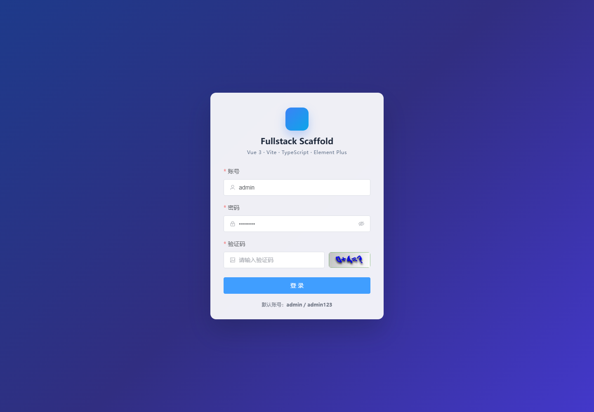
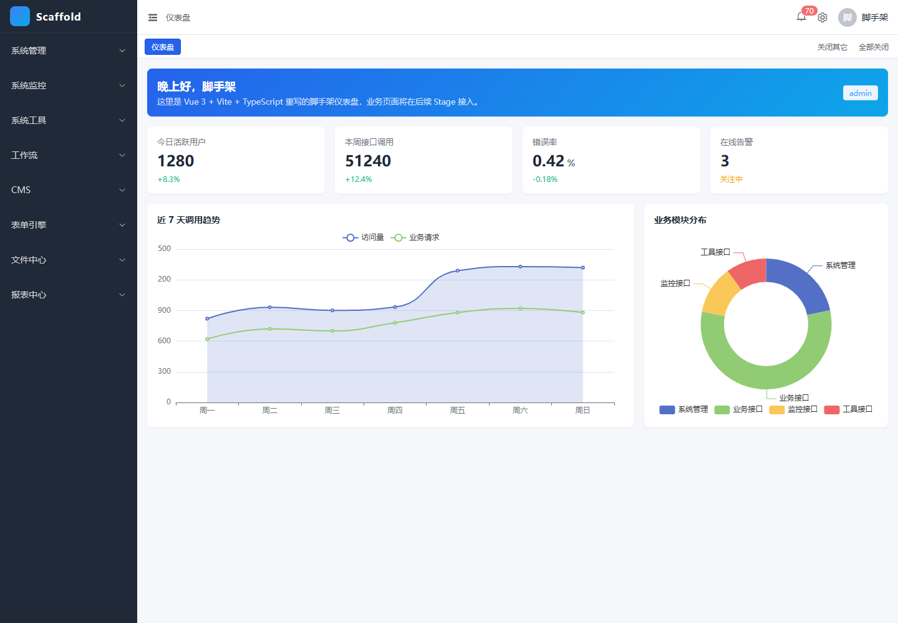
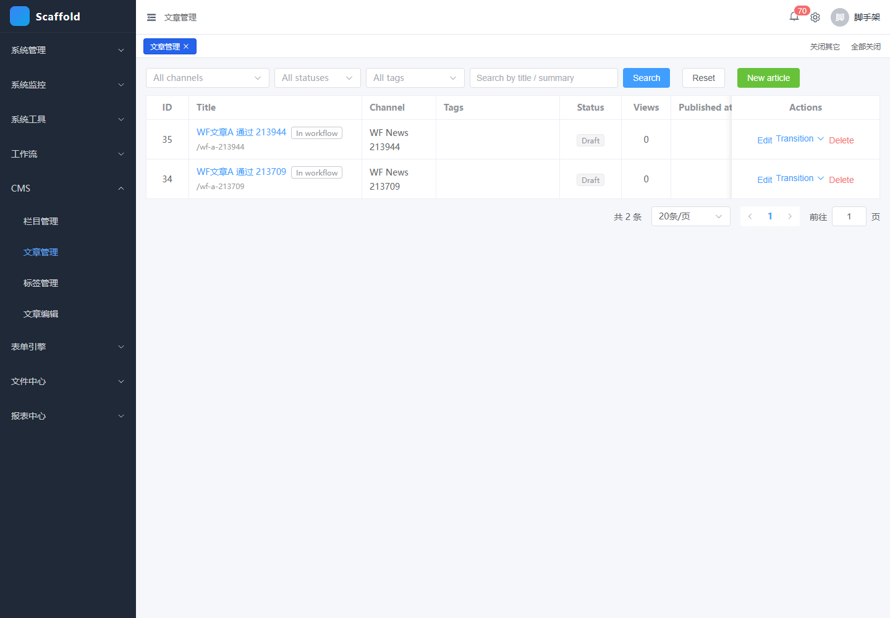

# 双仓发布与验证说明

本文档用于把当前主仓发布为两个仓库：

- **商业版仓库**：直接使用当前私有主仓，包含完整开源能力 + CRM / Ticket / PM / Inventory / OA 五个商业业务套件。
- **开源版仓库**：由 `tools/build-oss-snapshot.ps1` 从主仓生成，自动剥离商业后端模块、商业前端页面、商业验证脚本、商业截图和商业文档段落。

## 发布前结论

当前代码可以按“双仓”方式发布，但每次推送前必须跑完本文的验证矩阵。尤其要确认 OSS 快照不是只“剥离成功”，而是能独立构建、启动、登录，并且 `/getRouters` 不返回 CRM / Ticket / PM / Inventory / OA 菜单。

## 本次验证结果

验证时间：2026-05-16。

开源快照：

- `tools\build-oss-snapshot.ps1 -Force`：通过，leak-check 未发现商业目录、商业截图或商业路由残留。
- 后端 `mvn -f backend\pom.xml -DskipTests package`：通过。
- 前端 `npm install` / `npm run type-check`：通过。
- 后端 API 回归 `backend\scripts\run-all-verify.ps1`：8/8 通过（Pass: 8 / Fail: 0 / Missing: 0）。
- 业务功能 smoke：workflow / cms / cms-workflow / form / file / report / observability / data-scope 全部通过。
- Playwright UI 15/15 路由通过，菜单过滤校验：侧边栏不出现 CRM / Ticket / 工单 / 项目管理 / 进销存 / OA。
- `/getRouters`：实测返回 `/system /monitor /tool /workflow /cms /form /file /report` 共 9 项，**无任何商业路径**。

## 版本边界

开源版保留：

- 核心框架、系统管理、权限、审计、定时任务、代码生成。
- Workflow 基础引擎、CMS + CMS workflow、Form、File、Report、Inbox 基础、可观测性。
- 前端 `frontend/src/modules/*` 下的开源模块页面。

## 双仓首次绑定（一次性）

### 商业版（即当前主仓）

```powershell
cd c:\Users\hue7szh\LocalSoft\Code\project
git remote add commercial <商业私有仓 URL>      # 例如 git@gitlab.internal:foo/scaffold-commercial.git
git push -u commercial master                    # 当前主仓默认分支是 master；如果你切到 main 就推 main
```

> 命名 `commercial` 只是约定，也可以叫 `origin`。如果当前主仓已经绑了 `origin`，建议商业仓用 `commercial` 这个 remote 名字以便和将来可能的镜像区分。
> 远端仓库如果默认分支叫 `main`，第一次 push 时直接 `git push -u commercial master:main` 让两边对齐即可。

### 开源版（从主仓 → 独立仓库）

**首次发布**（开源仓还没有任何提交）：

```powershell
pwsh tools\release-oss.ps1                         # Mode=Fresh，生成 ..\scaffold-oss-snapshot
cd ..\scaffold-oss-snapshot
git remote add origin <开源仓 URL>
git push -u origin master
```

或一行干完：

```powershell
pwsh tools\release-oss.ps1 -PushFresh -OssRemote <开源仓 URL>
```

> Fresh 模式每次都会重写 `..\scaffold-oss-snapshot/.git`，对开源远端意味着 `git push --force`。仅适合首发或你愿意对外抹掉历史的发布策略。

**长期维护开源仓的历史**（推荐）：先把开源远端 clone 到一个固定工作树，比如 `D:\code\scaffold-oss`，之后每次发布走 Sync 模式：

```powershell
# 一次性
git clone <开源仓 URL> D:\code\scaffold-oss

# 每次发布
pwsh tools\release-oss.ps1 -OssRepoDir D:\code\scaffold-oss            # 仅生成 commit
pwsh tools\release-oss.ps1 -OssRepoDir D:\code\scaffold-oss -Push      # 生成 commit + 自动 git push
```

Sync 模式做了什么：

1. 在 `..\scaffold-oss-snapshot-staging` 重新生成无 git 的快照（leak-check 必通过）。
2. `robocopy /MIR` 把 staging 同步到 `OssRepoDir`，但跳过 `.git/` 和 `.github/`，保留开源仓的历史和 CI 配置。
3. `cd OssRepoDir; git add -A; git commit -m "Release from main @ <短哈希>"`。
4. 加了 `-Push` 才真的 `git push`。

## 商业版日常推送

商业版就是当前主仓。确认没有临时文件、密钥、`target/`、`node_modules/`、`dist/` 等构建产物进入提交后：

```powershell
git status
git diff
git add <需要提交的文件>
git commit -m "<提交说明>"
git push commercial master                       # 远端默认 main 时改成 master:main
```

> 建议商业仓保持私有，并把开源快照目录视为只读发布产物，不要反向合并回主仓。

## 开源版日常推送

```powershell
# 选择 Sync 模式（推荐）
pwsh tools\release-oss.ps1 -OssRepoDir <你的开源工作树> -Push

# 或选择 Fresh+Force（每次重写历史）
pwsh tools\release-oss.ps1 -PushFresh -OssRemote <开源仓 URL>
```

Sync 模式还可以加 `-CommitMsg "v1.2.0 - 工作流增强 + 多租户隔离"` 自定义 commit 文案。

## 验证矩阵

商业主仓：

```powershell
mvn -f backend\pom.xml -DskipTests package
cd frontend
npm install
npm run type-check
npm run build
cd ..
pwsh backend\scripts\run-all-verify.ps1
```

商业版运行联调：

```powershell
java -jar backend\scaffold-admin\target\scaffold-admin.jar
cd frontend
npm run dev
```

访问：

- 后端：`http://localhost:9080`
- 前端：`http://localhost:9081`
- 默认账号：`admin` / `admin123`

开源快照：

```powershell
pwsh tools\build-oss-snapshot.ps1 -Force
cd ..\scaffold-oss-snapshot
mvn -f backend\pom.xml -DskipTests package
cd frontend
npm install
npm run type-check
npm run build
```

开源版运行联调：

```powershell
java -jar backend\scaffold-admin\target\scaffold-admin.jar
cd frontend
npm run dev
```

开源版页面 smoke 至少覆盖：

- `/dashboard`
- `/monitor/observability-health`
- `/workflow/form-designer`
- `/cms/article`
- `/form/template`
- `/file/mine`
- `/report/dashboard`

开源版必须确认 `/getRouters` 不返回 CRM / Ticket / PM / Inventory / OA 菜单。即使复用曾经跑过商业版的数据库，也必须由后端按实际加载模块过滤掉商业菜单。

## 本次验证截图

### 开源版







## 常见发布风险

- **旧数据库残留商业菜单**：开源版必须依赖后端模块注册表过滤菜单，不要只靠数据库清理。
- **商业 changelog 残留**：OSS `db.changelog-master.yml` 不能 include `module-crm.yml`、`module-ticket.yml`、`module-pm.yml`、`module-inventory.yml`、`module-oa.yml`。
- **商业截图泄露**：商业截图必须使用 `commercial-*.png` 命名，并由 `tools/build-oss-snapshot.ps1` 删除。
- **脚本列表残留**：OSS `run-all-verify.ps1` 不能引用已删除的商业验证脚本。
- **文件锁**：Windows 下启动过 jar 或 Vite 后，重新生成 OSS 快照前先停掉 9080 / 9081 进程，避免 `target`、`node_modules` 被锁。

