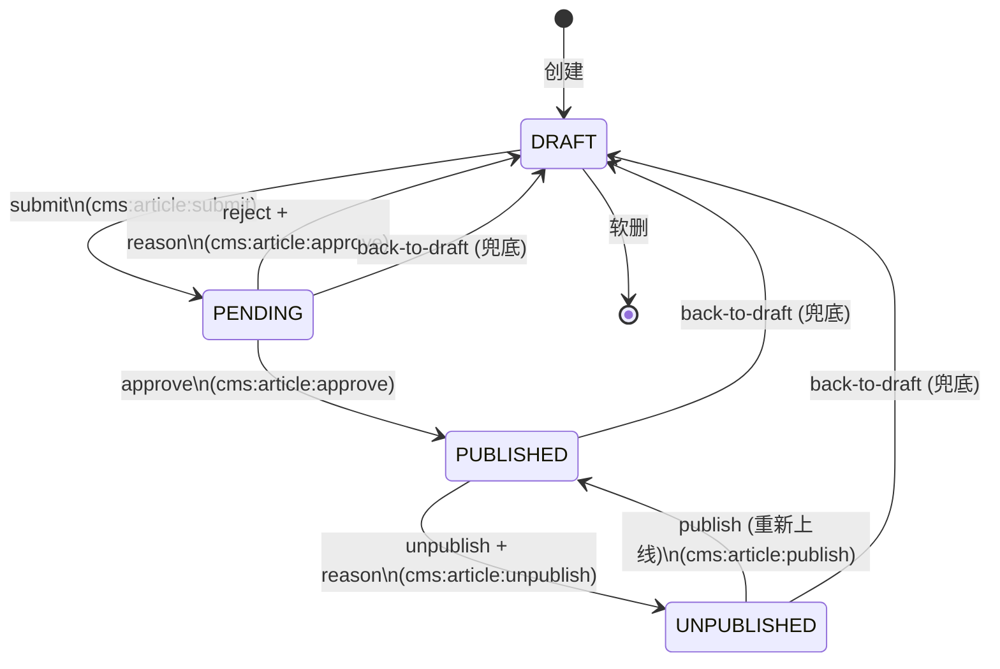
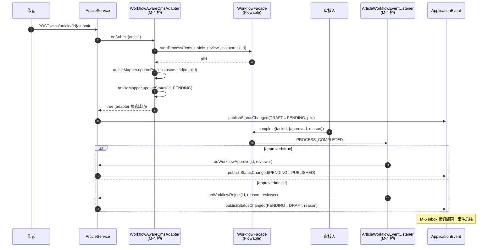

# 平台能力使用手册

本文聚焦**最近这一轮已落地的通用能力**该怎么用，按"业务开发者最常碰到"的顺序组织：错误码 → 缓存 → 字段脱敏 → 限流/幂等/锁 → API 版本 → 文件存储 → 推送总线 → 可观测性 → i18n / 主题。每一节都包含：能解决什么问题、关键源文件、最小示例、配置项、踩坑提示。

> 运维 / 部署相关参见 [`docs/RUNBOOK.md`](./RUNBOOK.md)。本文偏开发使用。

---

## 目录

- [1. 结构化错误码 + 双端 i18n](#1-结构化错误码--双端-i18n)
- [2. 缓存抽象 `CacheTemplate`](#2-缓存抽象-cachetemplate)
- [3. 字段脱敏 `@SensitiveLog`](#3-字段脱敏-sensitivelog)
- [4. 限流 / 幂等 / 分布式锁](#4-限流--幂等--分布式锁)
- [5. API 版本 `@ApiVersion`](#5-api-版本-apiversion)
- [6. 文件存储（本地 / S3 / MinIO / OSS）](#6-文件存储本地--s3--minio--oss)
- [7. WebSocket / STOMP 推送总线](#7-websocket--stomp-推送总线)
- [8. 可观测性 (Actuator / Prometheus / 结构化日志 / TraceId)](#8-可观测性)
- [9. 前端主题与多语言](#9-前端主题与多语言)
- [10. 常用研发命令速查](#10-常用研发命令速查)
- [11. OAuth2 / OIDC SSO（标准 Authorization Code 客户端）](#11-oauth2--oidc-sso)
- [12. 离线消息盒（与推送总线协同的可靠投递）](#12-离线消息盒)
- [13. 可插拔模块加载约定 (B-1/B-2/B-3)](#13-可插拔模块加载约定-b-1b-2b-3)
- [14. 操作审计 `@AuditLog` + `sys_audit_log`](#14-操作审计-auditlog--sys_audit_log)
- [15. 工作流模块（M-1，可插拔 Flowable 8）](#15-工作流模块m-1可插拔-flowable-8)
- [16. 数据级权限（Data Scope）](#16-数据级权限data-scope-已就绪--默认接入审计列表)
- [17. CMS 内容管理（M-3，可插拔模块）](#17-cms-内容管理m-3可插拔模块)
  - [17.5 工作流接入预留](#175-工作流接入预留) · [17.9 M-4 CMS × Workflow 联动桥](#179-m-4-cms--workflow-联动桥) · [17.10 M-5 CMS × Inbox 通知桥](#1710-m-5-cms--inbox-通知桥) · [17.11 Swagger / OpenAPI](#1711-swagger--openapi)
- [18. 报表中心（M-8，可插拔模块）](#18-报表中心m-8可插拔模块)
  - [18.2 SQL 三层防御](#182-sql-三层防御) · [18.3 数据源管理](#183-数据源管理) · [18.6 ECharts 懒加载](#186-echarts-懒加载) · [18.9 单测 + E2E](#189-单测--e2e)
- [20. 可观测性（Q-3，集成进 framework）](#20-可观测性q-3集成进-framework)
- [25. 文件中心（M-6，可插拔企业网盘）](#25-文件中心m-6可插拔企业网盘)
  - [25.5 引用计数语义](#255-引用计数ref_count-的语义) · [25.7 外链分享 token](#257-外链分享-token) · [25.8 与其他模块的解耦点](#258-与其他模块的解耦点) · [25.10 单测 + E2E](#2510-单测--e2e)
- [26. 表单引擎（M-10，可插拔动态表单）](#26-表单引擎m-10可插拔动态表单)
  - [26.5 schema 协议](#265-schema-协议form-create--element-plus) · [26.6 业务模块如何接入"自定义字段"](#266-业务模块如何接入自定义字段5-步法) · [26.7 与业务模块的 demo 集成](#267-与业务模块的-demo-集成) · [26.9 单测 + E2E](#269-单测--e2e)

---

## 1. 结构化错误码 + 双端 i18n

### 解决的问题

- 历史代码用裸 `int code` + 中文 `msg` 表达错误，前端没法稳定判定（文案随时改）。
- 多语言文案散落，难以维护。

### 关键源文件

| 文件 | 职责 |
| --- | --- |
| `backend/scaffold-common/src/main/java/com/scaffold/common/constant/ErrorCode.java` | 错误码契约 |
| `backend/scaffold-common/src/main/java/com/scaffold/common/constant/BizCode.java` | 通用业务码枚举 |
| `backend/scaffold-common/src/main/java/com/scaffold/common/exception/BizException.java` | 统一抛出 |
| `backend/scaffold-framework/src/main/java/com/scaffold/framework/web/exception/GlobalExceptionHandler.java` | 全局异常 → AjaxResult + i18n |
| `backend/scaffold-admin/src/main/resources/i18n/messages*.properties` | 服务端文案 |
| `frontend/src/utils/errorCode.ts` | 前端 errorKey → i18n 映射 |
| `frontend/src/locales/{zh-CN,en-US}.ts` | 前端文案 |

### 业务侧最小示例

抛业务错：

```java
import com.scaffold.common.constant.BizCode;
import com.scaffold.common.exception.BizException;

if (user == null) throw new BizException(BizCode.RESOURCE_NOT_FOUND);
if (overQuota)    throw new BizException(BizCode.RATE_LIMITED);
if (paramBad)     throw new BizException(BizCode.PARAM_INVALID, "phone 非法");
```

接口响应自动变成（`R<T>` / `AjaxResult` 都已支持）：

```json
{ "code": 429, "msg": "访问过于频繁，请稍后再试", "errorKey": "BIZ_RATE_LIMITED", "traceId": "..." }
```

前端 `request.ts` 拦截器优先按 `errorKey` 查 i18n；缺失时回退后端 `msg`。

### 新增错误码（一次完成 4 处）

1. `BizCode` 增加枚举值（保持稳定 errorKey，例如 `BIZ_ORDER_LOCKED`）。
2. `messages.properties` / `messages_en_US.properties` 增同名 key 文案。
3. 前端 `locales/zh-CN.ts` / `en-US.ts` 增 `errors.biz.<场景>`。
4. `frontend/src/utils/errorCode.ts` 的 `ERROR_KEY_I18N` 中加映射 `BIZ_ORDER_LOCKED: 'errors.biz.orderLocked'`。

### 踩坑

- `errorKey` 命名建议 `BIZ_<模块>_<场景>`，全大写 + 下划线，**永远不要改名**（前端会基于此分支处理）。
- 旧代码里的 `ServiceException(msg, code)` 仍兼容，但新代码请用 `BizException`。

---

## 2. 缓存抽象 `CacheTemplate`

### 解决的问题

- 业务自己写 `RedisCache.get / set` 容易出现：缓存击穿（高并发回源压垮 DB）、缓存穿透（恶意空查询）。
- 不想引 Redisson 这类重型依赖。

### 关键源文件

`backend/scaffold-common/src/main/java/com/scaffold/common/core/cache/CacheTemplate.java`

### 用法

```java
@Autowired CacheTemplate cache;

public User getUser(long id) {
    return cache.getOrLoad(
            "user:" + id,
            10, TimeUnit.MINUTES,           // 命中 TTL
            5,                              // 防击穿锁 TTL（秒，要 > loader P99）
            () -> userMapper.selectById(id) // loader：返回 null 时自动写 NULL_PLACEHOLDER 防穿透
    );
}

public void evictUser(long id) { cache.evict("user:" + id); }
```

### 行为

- **命中**：直接返回（`NULL_PLACEHOLDER` 自动转换为 `null`）。
- **未命中 + 拿到锁**：执行 `loader`，写缓存或写空占位（默认空占位 30 秒）。
- **未命中 + 没拿到锁**：自旋等持锁线程，最多等 `lockTtlSeconds`；超时后降级直接 `loader` 回源（仅那一次受影响）。

### 踩坑

- 缓存不能放可变对象的引用，建议存可序列化 DTO。
- `lockTtlSeconds` 略大于 loader 的 P99；过大会让其它线程多等，过小会出现"还没写好就放第二个进来"。
- 业务变更时记得 `evict`，否则会留 5–10 分钟脏数据。

---

## 3. 字段脱敏 `@SensitiveLog`

### 解决的问题

- 用户隐私字段（手机号、身份证、卡号）在响应、操作日志、第三方对接中容易泄露。

### 关键源文件

- `backend/scaffold-common/src/main/java/com/scaffold/common/annotation/SensitiveLog.java`
- `backend/scaffold-common/src/main/java/com/scaffold/common/annotation/SensitiveStrategy.java`
- `backend/scaffold-common/src/main/java/com/scaffold/common/core/json/SensitiveJsonSerializer.java`

### 用法

```java
public class UserVO {
    @SensitiveLog(strategy = SensitiveStrategy.CHINESE_NAME)
    private String name;

    @SensitiveLog(strategy = SensitiveStrategy.MOBILE)
    private String phone;

    @SensitiveLog(strategy = SensitiveStrategy.EMAIL)
    private String email;

    @SensitiveLog(strategy = SensitiveStrategy.ID_CARD)
    private String idCard;

    @SensitiveLog(strategy = SensitiveStrategy.BANK_CARD)
    private String bankCard;

    @SensitiveLog(strategy = SensitiveStrategy.PASSWORD)
    private String token;

    @SensitiveLog(strategy = SensitiveStrategy.CUSTOM, prefixKeep = 3, suffixKeep = 4, mask = "·")
    private String licenseKey;
}
```

### 内置策略

| 策略 | 说明 | 示例输出 |
| --- | --- | --- |
| `DEFAULT` | 保留首尾各 1 位 | `s****t` |
| `CHINESE_NAME` | 保留姓 | `张**` |
| `MOBILE` / `FIXED_PHONE` | 前 3 后 4 | `139****5678` |
| `EMAIL` | 首字母 + `@` 后缀 | `b****@example.com` |
| `ID_CARD` | 前 6 后 4 | `110101********1234` |
| `BANK_CARD` | 前 6 后 4 | `622588******8888` |
| `ADDRESS` | 保留前 6 字符 | `上海市浦东新***********` |
| `PASSWORD` | 全部脱敏 | `********` |
| `CUSTOM` | 自定义保留前缀/后缀 | 见上文 |

### 踩坑

- 注解只对 Jackson 序列化生效；如果你直接 `JSON.toJSONString(...)`（fastjson）或自己 `String.format`，脱敏不会触发——日志库或外部对接里建议改走 Jackson `ObjectMapper`。
- DTO 字段必须是 `String`；非字符串类型请先转字符串。
- Excel 导出（POI）走 `@Excel` 注解，目前未与 `@SensitiveLog` 联动；导出敏感字段需在 service 手工掩码或换实现类。

---

## 4. 限流 / 幂等 / 分布式锁

### 解决的问题

- 接口防刷、防抖、防并发改库存。

### 关键源文件

| 能力 | 关键类 |
| --- | --- |
| 限流 | `com.scaffold.common.annotation.RateLimit` + `com.scaffold.framework.aspectj.RateLimitAspect` |
| 幂等 | `com.scaffold.common.annotation.Idempotent` + `IdempotentAspect` |
| 分布式锁 | `com.scaffold.framework.lock.RedisLockTemplate` |

### `@RateLimit` 用法

```java
import com.scaffold.common.annotation.RateLimit;
import com.scaffold.common.annotation.RateLimit.LimitType;

@PostMapping("/captcha")
@RateLimit(count = 20, period = 60, limitType = LimitType.IP, message = "请求过于频繁")
public R<?> captcha() { ... }

@PostMapping("/order")
@RateLimit(count = 5, period = 10, limitType = LimitType.USER)
public R<?> placeOrder(@RequestBody OrderDTO dto) { ... }
```

- `period` 秒内最多 `count` 次（固定窗口，Redis Lua 原子执行）。
- `LimitType.DEFAULT` 按全局公共池，`IP` 按客户端 IP，`USER` 按登录用户名（未登录退化为 IP）。

### `@Idempotent`

```java
@PostMapping("/transfer")
@Idempotent(prefix = "wallet:transfer", key = "#req.requestId", expire = 30)
public R<?> transfer(@RequestBody TransferReq req) { ... }
```

- `key` 支持 SpEL，可访问方法参数、`#user`、`#ip`。
- 最终 Redis key 形如 `idempotent:wallet:transfer:<解析后的 key>`。
- 命中重复请求直接抛 `BizCode.DUPLICATE_SUBMIT`，前端依据 `errorKey` 提示"请勿重复提交"。
- 与 `@RepeatSubmit` 的差别：`@Idempotent` 是 Redis 分布式幂等（跨实例、跨会话）；`@RepeatSubmit` 仅同会话防抖。

### `RedisLockTemplate`

```java
@Autowired RedisLockTemplate locks;

// 模板法（推荐）：自动获取/释放，异常也会释放
Stock result = locks.runWithLock("stock:" + skuId, 5, () -> updateStock(skuId));

// 手动控制（拿到 token 再 release，避免误删别人的锁）
String token = locks.tryAcquire("daily:job", 60);
if (token != null) {
    try { runJob(); }
    finally { locks.release("daily:job", token); }
}
```

- `leaseSeconds` 是租约时长（秒），租约耗尽锁会自动释放，避免持锁线程崩溃后锁永久占用。
- 拿不到锁时 `runWithLock` 抛 `ServiceException("当前操作正在被其他请求处理，请稍候再试")`；`tryAcquire` 返回 `null`。
- TODO（路线图）：将 `runWithLock` 切换为抛 `BizException(BizCode.CONFLICT)`，与新错误码体系对齐。

### 踩坑

- 限流是**固定窗口**，临界点会有 2 倍突刺；如需平滑可换滑动窗口或令牌桶（路线图里有）。
- 幂等 key 一般取业务 ID（订单号、`requestId`），不要用时间戳。
- 锁 TTL 必须比临界区耗时大，否则会出现"还没干完锁过期 → 第二个进来"。

---

## 5. API 版本 `@ApiVersion`

### 解决的问题

- 接口要平滑升版（v1 老客户端继续用，v2 新功能）。

### 关键源文件

- `backend/scaffold-common/src/main/java/com/scaffold/common/annotation/ApiVersion.java`
- `backend/scaffold-framework/src/main/java/com/scaffold/framework/web/version/ApiVersionRequestMappingHandlerMapping.java`
- `backend/scaffold-framework/src/main/java/com/scaffold/framework/web/version/ApiVersionCondition.java`
- `backend/scaffold-framework/src/main/java/com/scaffold/framework/config/WebMvcCustomizeConfig.java`

### 用法

```java
@RestController
@RequestMapping("/v{version}/order")
@ApiVersion(1)
public class OrderController {

    @GetMapping("list")
    public R<?> listV1() { ... }

    @ApiVersion(2)
    @GetMapping("list")
    public R<?> listV2() { ... }
}
```

- 客户端请求 `/v2/order/list` 命中 v2，请求 `/v3/order/list` 也会命中 v2（向上兼容，匹配最高 ≤ 请求版本的方法）。
- 类上的 `@ApiVersion` 是默认版本，方法上可覆盖。

### 踩坑

- 路径里**必须**有 `/v{version}/` 占位，否则不生效。
- 别同时既写 `@ApiVersion` 又自己解析 path variable，会绕成迷宫。
- 这是**路径版本化**（最直观、利于缓存/网关）；如果想用 Header 版本（`X-Api-Version`），可仿照写一个 condition。

---

## 6. 文件存储（本地 / S3 / MinIO / OSS）

### 关键源文件

- 接口：`com.scaffold.common.core.storage.FileStorageService`
- 本地实现：`...storage.impl.LocalFileStorageService`
- S3 兼容实现：`...storage.impl.S3FileStorageService`
- 配置：`com.scaffold.common.core.storage.properties.FileStorageProperties`
- 自动装配：`com.scaffold.framework.config.FileStorageConfig`

### 切换实现

`application.yml` / `.env`：

```yaml
file:
  storage:
    type: ${FILE_STORAGE_TYPE:local}   # local / s3
    url-prefix: ${FILE_STORAGE_URL_PREFIX:/profile}
    s3:
      endpoint: ${S3_ENDPOINT}         # MinIO / OSS / COS / S3
      region: ${S3_REGION:us-east-1}
      access-key: ${S3_ACCESS_KEY}
      secret-key: ${S3_SECRET_KEY}
      bucket: ${S3_BUCKET}
      path-style: ${S3_PATH_STYLE:true}
      public-url: ${S3_PUBLIC_URL}     # CDN 或公开访问域名
```

### 业务用法

```java
@Autowired FileStorageService storage;

public String upload(MultipartFile file) throws IOException {
    String suffix    = StringUtils.substringAfterLast(file.getOriginalFilename(), ".");
    String objectKey = "uploads/" + LocalDate.now() + "/" + UUID.randomUUID() + "." + suffix;
    String url       = storage.store(objectKey,
            file.getInputStream(), file.getContentType(), file.getSize());
    return url;                         // 客户端可访问的 URL
}

// 删除
storage.delete(objectKey);

// 获取访问 URL（公开桶 / CDN 拼接）
String url = storage.resolveUrl(objectKey);
```

### 踩坑

- MinIO 必须开 `path-style: true`，AWS S3 默认是 virtual-hosted-style。
- 私有桶要自己签 URL 给前端；本仓库的 S3 实现目前只暴露公开 URL，路线图里有"S3 预签名直传"。
- 上传大文件要看 `spring.servlet.multipart.max-file-size`、Nginx `client_max_body_size`。

---

## 7. WebSocket / STOMP 推送总线

### 架构

```
业务服务 → MessagePublisher.toUser/toTopic
            ↓ 序列化
         Redis Pub/Sub（频道 scaffold:ws:bus）
            ↓ 各节点订阅
         RedisMessageBus.deliverLocal
            ↓ SimpMessagingTemplate
         浏览器订阅的 STOMP 会话（/user/queue/notice 或 /topic/<x>）
```

### 关键源文件

- `backend/scaffold-framework/src/main/java/com/scaffold/framework/web/websocket/`
  - `WebSocketStompConfig` — 注册 `/ws` 端点
  - `JwtHandshakeInterceptor` — 握手时按 `?token=` / `Authorization` 验 JWT
  - `AuthHandshakeHandler` + `StompPrincipal` — 绑定登录用户名
  - `bus/MessagePublisher` + `bus/RedisMessageBus` + `bus/RedisMessageBusConfig` — 多实例 fan-out
  - `bus/PushMessage` — 消息体（含 `id`/`type`/`scope`/`payload`/`timestamp`）
- `backend/scaffold-admin/src/main/java/com/scaffold/web/controller/system/WebSocketPushController.java` — REST 入口
- `frontend/src/utils/websocket.ts` — `WebSocketBus` 封装
- `frontend/src/stores/notification.ts` — Pinia 通知 store
- `frontend/src/layout/components/TopBar.vue` — 铃铛 UI

### 后端发消息

```java
@Autowired MessagePublisher publisher;

// 点对点（投递到 /user/<username>/queue/notice）
publisher.toUser("alice", "order.shipped", Map.of("orderId", 123, "track", "SF1234"));

// 主题广播（投递到 /topic/<name>）
publisher.toTopic("system.broadcast", "maintenance",
        Map.of("eta", "2026-05-10 02:00", "reason", "DB upgrade"));

// 想自带去重 ID
publisher.toUser("alice", "wallet.deduct", "txn-20260505-0001",
        Map.of("amount", 12.5));
```

REST 触发（管理后台 / 内部系统）：

```http
POST /system/message/user
{ "username": "alice", "type": "order.shipped", "payload": {...} }

POST /system/message/topic
{ "topic": "system.broadcast", "type": "maintenance", "payload": {...} }
```

需要权限码 `system:message:push`。

### 前端订阅

不用直接 import，**登录后** TopBar 会自动 `notificationStore.connect()`。如果业务页面要单独消费某个 topic：

```ts
import { onBeforeUnmount } from 'vue'
import { useNotificationStore } from '@/stores/notification'
import { getWebSocketBus, type PushMessage } from '@/utils/websocket'

const store = useNotificationStore()
store.subscribeTopic('order.events')

// 或者要自定义处理（不进通知中心列表）：
const bus = getWebSocketBus()
const off = bus.onTopic<{ orderId: number; status: string }>('order.events', (msg) => {
  console.log('order changed', msg.payload)
})

onBeforeUnmount(() => off())
```

### 配置

```yaml
websocket:
  allowed-origins: ${WEBSOCKET_ALLOWED_ORIGINS:*}    # 生产改成实际域名
  bus:
    channel: ${WEBSOCKET_BUS_CHANNEL:scaffold:ws:bus}
```

Nginx 反代：

```nginx
location /ws {
    proxy_pass http://backend:8080;
    proxy_http_version 1.1;
    proxy_set_header Upgrade $http_upgrade;
    proxy_set_header Connection "upgrade";
    proxy_set_header Host $host;
    proxy_read_timeout 600s;
}
```

### 踩坑

- 客户端在 token 过期后会一直重连失败，store 状态会变 `error`；`useUserStore.token` 失效后调 `notificationStore.disconnect()`。
- 多实例必须**所有节点连同一 Redis**且订阅同一频道。
- 如要离线消息（用户不在线时也要送达），目前不持久化，需要加 `Redis Stream` 或入库（路线图里有）。

---

## 8. 可观测性

### Actuator / Prometheus

`application.yml` 默认开放：

```yaml
management:
  endpoints:
    web:
      exposure:
        include: ${ACTUATOR_EXPOSE:health,info,prometheus,metrics,env,loggers}
```

常用端点：

| 端点 | 用途 |
| --- | --- |
| `/actuator/health` | liveness / readiness 探针 |
| `/actuator/prometheus` | Prometheus 抓取 |
| `/actuator/metrics/<name>` | 单指标查询 |
| `/actuator/loggers/<logger>` | 在线调日志级别 |

### TraceId 链路标识

- `com.scaffold.common.core.trace.TraceContext` 用 `MDC` 维护 `traceId`。
- `R` / `AjaxResult` 每次响应自动带 `traceId` 字段。
- 前端 axios 把 `X-Trace-Id` 响应头透传到下次调用，便于一条链路串上下游。

### JSON 结构化日志

`logback-spring.xml` 的 `json` profile：

```bash
java -jar scaffold-admin.jar --spring.profiles.active=druid,json
```

输出形如：

```json
{"@timestamp":"...","level":"INFO","logger":"...","message":"...","traceId":"abc","app":"scaffold","mdc":{...}}
```

ELK / Loki 可直接消费。

---

## 9. 前端主题与多语言

- 主题：`frontend/src/stores/theme.ts`，模式 `light / dark / auto`，自动落 `localStorage`。
- 语言：`frontend/src/locales/index.ts`，默认按浏览器语言；`setLocale('en-US')` 切换。
- Settings 抽屉里有 UI；`useThemeStore().setMode('dark')` / `setLocale('en-US')` 也可程序化触发。

---

## 10. 常用研发命令速查

```powershell
# 后端
mvn -pl scaffold-admin -am -B clean install -DskipTests=true   # 构建
mvn -pl scaffold-admin -B test                                  # 单测
java -jar backend\scaffold-admin\target\scaffold-admin.jar      # 启动

# 前端
npm run dev          # Vite 开发
npm run lint         # ESLint
npm run type-check   # vue-tsc
npm run test         # Vitest
npm run test:e2e     # Playwright（首次先 npm run test:e2e:install）
npm run build        # 生产构建
npm run build:report # 体积分析（dist/stats.html）
npm run gen:openapi  # 拉后端 /v3/api-docs 生成 TS 类型

# Docker
docker compose up --build       # 全套
docker compose up -d mysql redis # 仅基础设施
```

---

## 11. OAuth2 / OIDC SSO

### 解决的问题

让本平台能作为 **OAuth2 Authorization Code 客户端**接入任何符合标准协议的 IDP（Azure AD / Okta / Keycloak / 自建 OIDC 等）。流程标准化，不绑死某个厂商。

### 关键源文件

- 后端依赖：`spring-boot-starter-oauth2-client`（在 `backend/scaffold-framework/pom.xml`）
- 解析器：`backend/scaffold-framework/src/main/java/com/scaffold/framework/web/oauth2/OAuth2UserResolver.java`
- 成功 / 失败处理：`backend/scaffold-framework/src/main/java/com/scaffold/framework/web/oauth2/SsoAuthenticationHandlers.java`
- Security 接线：`backend/scaffold-framework/src/main/java/com/scaffold/framework/config/SecurityConfig.java`（仅当存在 `ClientRegistrationRepository` Bean 时挂载 oauth2Login）
- 元数据接口：`backend/scaffold-admin/src/main/java/com/scaffold/web/controller/system/SsoMetaController.java`（`GET /sso/providers`）
- 数据库：`sys_user_external_identity`，Liquibase changeset `20260505-sso-external-identity`
- 前端：`frontend/src/views/login.vue`（登录页拉按钮）、`frontend/src/views/sso/callback.vue`（回调落 token）

### 工作机制

1. 前端登录页调用 `GET /sso/providers` 拿到当前已配置的 IDP 列表（按钮）。
2. 用户点击 "Azure" → 跳转后端 `/oauth2/authorization/azure` → Spring Security 转 IDP 登录页。
3. IDP 回跳 `/login/oauth2/code/azure` → Spring Security 拿 code 换 token → 解析用户。
4. `SsoAuthenticationHandlers#onAuthenticationSuccess` 调用 `OAuth2UserResolver.resolveOrProvision`：
   - 先按 `(provider, sub)` 查 `sys_user_external_identity`。
   - 没有就按 IDP 返回的 `email` 找本地 `sys_user` 做"补绑"。
   - 还没有就按 `sso.auto-provision` 自动开户（默认 disabled，需管理员审核启用）。
5. 拿到 `LoginUser` → `TokenService.createToken` → 302 到 `/sso/callback?token=…&provider=…`。
6. 前端 `views/sso/callback.vue` 用 `setToken` 落 cookie → 跳首页，后续走 JWT 链路。

### 配置示例

```yaml
sso:
  auto-provision: true              # false 时未绑定且本地无对应 email 的用户会被拒绝
  auto-provision-status: 1          # 自动开户用户初始 status，1=禁用（建议），0=正常
  front-callback: /sso/callback     # 前端回调路径
  failure-redirect: /login          # 失败回跳，会附带 ssoError 参数
  providers:                        # 按钮元数据（可选）
    azure.label: "Azure AD"
    azure.icon: "mdi-microsoft"

spring:
  security:
    oauth2:
      client:
        registration:
          azure:                    # 注册名 = 上面 provider id 与 /oauth2/authorization/<id> 后缀
            client-id: ${AZURE_CLIENT_ID}
            client-secret: ${AZURE_CLIENT_SECRET}
            scope: openid,profile,email
            provider: azure
            redirect-uri: "{baseUrl}/login/oauth2/code/{registrationId}"
        provider:
          azure:
            issuer-uri: https://login.microsoftonline.com/<tenant>/v2.0
```

> 不配置任何 `registration.*` 时整个 SSO 入口会自动关闭：`SsoMetaController` 返回空数组，前端不显示按钮，`SecurityConfig` 也不会注册 oauth2Login 链。

### 踩坑提示

- `redirect-uri` 必须与 IDP 后台登记的回调一致；多环境不要硬编码 host，用 `{baseUrl}` 占位由 Spring 自动拼。
- IDP 返回的 `sub` 只在该 provider 内唯一，所以表的唯一键是 `(provider, subject)`，跨 provider 同一个 sub 会被当成不同用户。
- 自动开户用的随机密码无法用本地账号密码登录，相当于强制走 SSO；管理员重置密码后才能本地登录。
- 多前端域名时把 `failure-redirect` / `front-callback` 配置成绝对 URL，或者用 nginx 把 `/sso/callback` 转回前端站点。
- 如果 IDP 不返回 `email`（如部分 OAuth2 非 OIDC），`OAuth2UserResolver` 退化为只用 `sub` 直接自动开户，不做"按邮箱补绑"。

---

## 12. 离线消息盒

### 解决的问题

WebSocket 总线只能给"现在在线的用户"投递消息。当用户下线、刷新、跨实例时仍要保证业务消息（订单状态、审批结果等）不丢，需要落库 + 上线拉取 + ACK。

### 关键源文件

> **本能力是脚手架第一个"可插拔业务模块"**，独立 Maven 子模块 `backend/scaffold-module-inbox` + 前端 `frontend/src/modules/inbox/`。删除整目录与 `pom.xml`/`vite glob` 引用即可下线。详见 [§13](#13-可插拔模块加载约定-b-1b-2b-3)。

- 后端（`scaffold-module-inbox`）：
  - 模块入口：`backend/scaffold-module-inbox/src/main/java/com/scaffold/module/inbox/InboxModuleAutoConfiguration.java`（`@AutoConfiguration` + `@ConditionalOnProperty(prefix=app.module.inbox)`）
  - 实体：`com.scaffold.module.inbox.domain.MessageInboxEntry`
  - Mapper：`com.scaffold.module.inbox.mapper.MessageInboxMapper` + `resources/mapper/inbox/MessageInboxMapper.xml`
  - 服务：`com.scaffold.module.inbox.service.MessageInboxService`
  - 与总线对接：`com.scaffold.module.inbox.service.InboxMessageBusRecorder`（实现 framework 的 `MessageBusRecorder` 接口；framework 不依赖本模块）
  - 清理任务：`com.scaffold.module.inbox.MessageInboxCleanupJob`
  - REST：`com.scaffold.module.inbox.controller.MessageInboxController`（`/system/inbox/...`）
  - 数据库：`sys_message_inbox`，Liquibase changelog `db/changelog/module-inbox.yml`，模块自带 SQL 与 `*-uninstall.sql`
- 前端（`frontend/src/modules/inbox/`）：
  - 模块入口：`frontend/src/modules/inbox/index.ts`（默认导出 `ScaffoldFrontendModule`）
  - API：`frontend/src/modules/inbox/api.ts`
  - Store：`frontend/src/modules/inbox/store.ts`（`connect()` 时自动 `loadUnreadFromInbox`，`markAsRead` / `markAllRead` 联通 ack）
  - UI：`frontend/src/modules/inbox/components/NotificationBell.vue`，通过 `registerTopBarWidget` 注入到 TopBar，TopBar 自身不引用本模块

### 工作机制

业务侧调用方式不变 —— 还是 `messagePublisher.toUser(...)`，只是流程多了一步：

```
业务调用 → 1) 入 sys_message_inbox（USER scope 才入库）
        → 2) Redis Pub/Sub fan-out
        → 3) 在线节点本地 SimpMessagingTemplate 投递
        → 4) 用户上线 / 重连：前端 GET /system/inbox/unread 拉缺失消息
        → 5) 用户读到后调 POST /system/inbox/{id}/ack 更新状态
        → 6) Quartz 每天 03:30 运行 cleanupExpired 清理过期 / 已读历史
```

### 配置示例

```yaml
inbox:
  default-ttl-seconds: 604800   # 默认保留 7 天，超时自动 status=2
  persist: true                 # false 时退化为纯瞬时推送（不入库）
  cleanup:
    enabled: true               # false 关闭清理任务
    cron: "0 30 3 * * ?"        # 默认每天 03:30
    retain-days: 30             # 已读 / 过期消息保留多少天后物理删除
```

### REST API

| 方法 | 路径 | 说明 |
|------|------|------|
| GET  | `/system/inbox/unread?limit=50` | 当前用户未读列表 |
| GET  | `/system/inbox/unread-count`    | 当前用户未读数 |
| POST | `/system/inbox/{id}/ack`        | 单条标已读 |
| POST | `/system/inbox/ack-all`         | 全部标已读 |

### 踩坑提示

- `TOPIC` 范围消息**不入库**：每个订阅者独立维护已读会让表写放大严重，按需要可在业务侧再封装"展开成 N 条 USER 消息"。
- 唯一键是 `(scope, target, message_id)`：业务自定义 `messageId` 时记得保证唯一，否则会被 `INSERT IGNORE` 静默吞掉。
- 多实例下 inbox 落库有事务，但 Redis fan-out 没有；少数情况下"入库成功 + Redis 故障"仍能让用户上线时看到消息（这就是 inbox 存在的意义）。
- 上线后 `loadUnreadFromInbox` 一次最多拉 `MAX_KEPT=100` 条；超量历史消息建议加专门的 "我的消息" 列表页分页查询。

---

## 13. 可插拔模块加载约定 (B-1/B-2/B-3)

### 解决的问题

新项目复用脚手架时常见两类诉求：

1. **加功能**：直接在 fork 上接业务模块（工作流、CMS、报表…）。
2. **删功能**：去掉用不到的能力（如 inbox、SSO、定时任务），但不想动主项目源码。

之前两类都靠"硬编码 + 手工裁剪"。本节落地的约定让"加 / 删模块只动一个目录"。inbox 已按此重构为第一个样板。

### 三层硬约束

| 层 | 约定 | 删模块的操作 |
|----|------|--------------|
| **后端** | 每个业务模块是独立 Maven 子模块 `backend/scaffold-module-<name>`，包名 `com.scaffold.module.<name>`；自带 `<Name>ModuleAutoConfiguration`（`@AutoConfiguration` + `@ConditionalOnProperty(prefix="app.module.<name>", name="enabled", matchIfMissing=true)`），通过 `META-INF/spring/org.springframework.boot.autoconfigure.AutoConfiguration.imports` 自启 | 删 `backend/scaffold-module-<name>` 目录 + 主 `pom.xml` 删模块声明 + `scaffold-admin/pom.xml` 删依赖 |
| **前端** | 每个模块是 `frontend/src/modules/<name>/index.ts` 默认导出 `ScaffoldFrontendModule { name, routes?, locales?, install? }`；`main.ts` 通过 `import.meta.glob('./modules/*/index.ts', { eager: true })` 自动发现并加载；UI 集成（顶栏图标等）通过 `frontend/src/layout/widgets.ts` 的 `registerTopBarWidget` 注入，TopBar 自身**不**引用任何模块 | 删 `frontend/src/modules/<name>` 整目录 |
| **数据库** | 每个模块自带 `db/changelog/module-<name>.yml`（在自己 jar 的 `resources` 下）；主 `db.changelog-master.yml` 用 `include` 引用 + `errorIfMissingOrEmpty: false`（模块缺失不报错）；模块同时自带 `*-uninstall.sql` 模板 | 删模块 jar 后主 changelog include 找不到文件即跳过；如需清表，运行 `*-uninstall.sql` |

ScaffoldApplication 的 `@ComponentScan` 已**显式排除** `com.scaffold.module.*` —— 这样 `app.module.<name>.enabled=false` 时整个模块组件都不会被扫到，达到**真正的"配置即关停"**。

### 关键源文件

- **基础设施**：
  - `backend/scaffold-common/src/main/java/com/scaffold/common/module/ScaffoldModule.java`（模块元数据值对象）
  - `backend/scaffold-common/src/main/java/com/scaffold/common/module/ModuleRegistry.java`（启动后聚合 + 打印 + 提供 actuator 数据）
  - `backend/scaffold-admin/src/main/java/com/scaffold/web/actuator/ScaffoldModuleEndpoint.java`（`GET /actuator/scaffold-modules`）
  - `backend/scaffold-framework/src/main/java/com/scaffold/framework/web/websocket/bus/MessageBusRecorder.java`（业务模块向总线挂载点的 SPI 接口）
  - `backend/scaffold-admin/src/main/java/com/scaffold/ScaffoldApplication.java`（`@ComponentScan(excludeFilters=...)` 把 `com.scaffold.module.*` 排除）
  - `frontend/src/modules/loader.ts`（`loadFrontendModules` + `ScaffoldFrontendModule` 接口）
  - `frontend/src/layout/widgets.ts`（顶栏组件槽注册表）
- **样板模块（inbox）**：
  - `backend/scaffold-module-inbox/...`
  - `frontend/src/modules/inbox/...`

### 创建一个新业务模块的步骤（以 `workflow` 为例）

#### 后端

1. 在 `backend/` 下新建目录 `scaffold-module-workflow/`：

```
scaffold-module-workflow/
├─ pom.xml                                # parent=scaffold; <artifactId>scaffold-module-workflow</artifactId>; 依赖 scaffold-framework
└─ src/main/
   ├─ java/com/scaffold/module/workflow/
   │  ├─ WorkflowModuleAutoConfiguration.java
   │  ├─ controller/...                   # @RestController 用 /workflow/...
   │  ├─ service/...
   │  ├─ mapper/...                       # 包名以 .mapper 结尾，匹配 @MapperScan("com.scaffold.**.mapper")
   │  └─ domain/...
   └─ resources/
      ├─ META-INF/spring/org.springframework.boot.autoconfigure.AutoConfiguration.imports
      │   # 内容：com.scaffold.module.workflow.WorkflowModuleAutoConfiguration
      ├─ db/changelog/module-workflow.yml
      ├─ db/changelog/sql/wf_*.sql
      └─ mapper/workflow/<XxxMapper>.xml
```

2. `WorkflowModuleAutoConfiguration` 的最小骨架：

```java
@AutoConfiguration
@ConditionalOnProperty(prefix = "app.module.workflow", name = "enabled", havingValue = "true", matchIfMissing = true)
@ComponentScan(basePackages = "com.scaffold.module.workflow")
public class WorkflowModuleAutoConfiguration {
    @Bean
    public ScaffoldModule workflowModuleDescriptor() {
        return ScaffoldModule.of("workflow", "0.1.0", "Flowable 7 工作流引擎");
    }
}
```

3. 主 `backend/pom.xml` 在 `<modules>` 中增加 `<module>scaffold-module-workflow</module>`，并在 `<dependencyManagement>` 中声明版本。
4. `backend/scaffold-admin/pom.xml` 在 `<dependencies>` 中加一行：

```xml
<dependency>
    <groupId>com.scaffold</groupId>
    <artifactId>scaffold-module-workflow</artifactId>
</dependency>
```

5. 在主 `db.changelog-master.yml` 中添加：

```yaml
- include:
    file: db/changelog/module-workflow.yml
    errorIfMissingOrEmpty: false
```

#### 前端

1. 在 `frontend/src/modules/` 下新建 `workflow/`：

```
workflow/
├─ index.ts                # 默认导出 ScaffoldFrontendModule
├─ api/
├─ store.ts
├─ locales/{zh-CN.ts,en-US.ts}
├─ components/
└─ views/
```

2. `index.ts` 最小骨架：

```ts
import type { ScaffoldFrontendModule } from '../loader'
import zhCN from './locales/zh-CN'
import enUS from './locales/en-US'

const workflowModule: ScaffoldFrontendModule = {
  name: 'workflow',
  routes: [
    { path: 'workflow/todo', component: () => import('./views/Todo.vue'), meta: { title: '待办' } }
  ],
  locales: { 'zh-CN': zhCN, 'en-US': enUS },
  install(_ctx) {
    // 可选：注册 widget / 全局组件 / 指令等
  }
}
export default workflowModule
```

完成后无需修改 `main.ts` 或 `router/index.ts`。

### 关停 / 卸载 / 验证

| 操作 | 命令 |
|------|------|
| **暂时关停**（保留 jar 与目录） | 后端：`app.module.<name>.enabled=false`；前端：把 `modules/<name>` 改名为 `.<name>-disabled`（vite glob 不会匹配） |
| **彻底卸载** | 删除 `backend/scaffold-module-<name>` + `frontend/src/modules/<name>` + admin pom 依赖 + 主 changelog 的 include；如需清表，跑 `*-uninstall.sql` |
| **查看当前启用模块** | `GET /actuator/scaffold-modules`（需登录或开放 actuator）；启动日志里也会一次性打印 |
| **回归测试** | 后端 `mvn -pl scaffold-admin -am test`；前端 `npm run type-check && npm run build` |

inbox 已经按上述规则跑通：删除 `backend/scaffold-module-inbox` 模块依赖后 `mvn compile` 仍可通过；移走 `frontend/src/modules/inbox` 后 `npm run build` 仍可通过。

### 踩坑提示

- **包名** 必须落到 `com.scaffold.module.<name>.*`，否则 `ScaffoldApplication` 的 `excludeFilters` 不会精确命中，`enabled=false` 时仍会被扫到。
- **跨模块强依赖** 是反模式：framework / common 不要 import 任何模块包；模块之间也尽量通过 framework 暴露的接口（如 `MessageBusRecorder`）解耦。
- **Mapper 包名**：必须以 `.mapper` 结尾才会被 `@MapperScan("com.scaffold.**.mapper")` 命中。
- **AutoConfiguration 不要做重业务初始化**（如建 ThreadPool、连接外部服务），保持启动期失败容错；业务初始化交给被 ComponentScan 加载的 `@PostConstruct`。
- **changelog 命名空间**：每个模块用 `<module>-<date>-<seq>` 作为 `changeSet.id` 前缀，避免被其他模块或主项目的 changeset 顺序串行 hash 化时冲突。

---

## 14. 操作审计 `@AuditLog` + `sys_audit_log`

### 解决的问题

脚手架原本只有 `@Log` + `sys_oper_log`（参考 RuoYi）记录"谁、何时、调了哪个接口、传了什么参数"。这类**流水**适合排错，但合规审计需要：

1. **结构化资源标识**——按模块 / 资源 ID 检索，例如"alice 这两个月对哪些用户做过修改"。
2. **变更前/后快照 + 差异** —— 变更内容要可视化，不是塞一坨 JSON 让人手 diff。
3. **保留期长** —— 审计常常要保留 6 个月到 7 年；流水可以短很多。

`@AuditLog` + `sys_audit_log` 解决这些需求，**与 `@Log` 互补共存**：关键写操作建议两个都挂，流水进 `sys_oper_log`，事件进 `sys_audit_log`。

### 关键源文件

- 注解：`backend/scaffold-common/src/main/java/com/scaffold/common/annotation/AuditLog.java`
- 切面：`backend/scaffold-framework/src/main/java/com/scaffold/framework/aspectj/AuditLogAspect.java`
- 工具类（可单测）：`backend/scaffold-framework/src/main/java/com/scaffold/framework/aspectj/AuditDiffSupport.java`
- 实体 / Mapper / Service：`backend/scaffold-system/.../SysAuditLog*.java` + `mapper/system/SysAuditLogMapper.xml`
- 异步写入：`AsyncFactory.recordAudit(...)`（与 `recordOper` 同机制）
- REST：`backend/scaffold-admin/.../SysAuditLogController.java`（`/system/audit/log/...`）
- 数据库：`sys_audit_log`，Liquibase changeset `20260506-sys-audit-log`
- 前端：
  - API：`frontend/src/api/system/audit.ts`
  - 列表页 + diff 渲染：`frontend/src/views/system/audit/index.vue`
  - 路由：`/system/audit/log`，`name=SystemAuditLog`

### 工作机制

```
Controller @AuditLog(...)
   └─ Around 切面（AuditLogAspect）
        ├─ 1. SpEL 解析 beforeProvider → 生成 before 对象
        ├─ 2. 调用业务方法
        ├─ 3. 把返回值作为 after（recordReturn=true）
        ├─ 4. 用 fastjson 序列化（统一抹敏感字段：password 等 + 业务 excludeFields）
        ├─ 5. 用 zjsonpatch 计算 RFC 6902 JSON Patch
        └─ 6. AsyncManager 异步写入 sys_audit_log（不阻塞业务）
```

切面设计原则：
- **不阻断业务**：所有审计相关异常都吞掉 + warn 日志。
- **不强依赖任何业务表**：失败只丢一条审计，主流程照常返回。
- **严格抹敏感字段**：`password / oldPassword / newPassword / confirmPassword / salt` 默认全局排除。

### 注解参数

```java
@AuditLog(
    module = "system.user",                            // 必填，建议层级用 . 分隔
    action = "UPDATE",                                  // 必填，自由字符串（CREATE/UPDATE/DELETE/APPROVE/REJECT/...）
    resourceType = "user",                              // 可选
    resourceId = "#user.userId",                        // SpEL，用方法参数 / 返回值
    comment = "'修改用户 ' + #user.userName",           // SpEL，人类可读说明
    beforeProvider = "@sysUserServiceImpl.selectUserById(#user.userId)",  // SpEL，可调 service 拿原数据
    recordReturn = true,                                // 是否把方法返回值作为 after
    excludeFields = { "phonenumber" }                   // 在全局敏感字段之上额外排除
)
```

支持的 SpEL 上下文：
- 按参数名 / 索引访问入参（如 `#user`, `#userId`, `#a0`）。
- `#root.method` / `#root.target`：当前方法 / bean。
- `#result`：方法返回值（仅 success-after 阶段；before 阶段为 null）。

### 已挂载样板

`SysUserController` 里 5 个关键写操作已加 `@AuditLog`：
- `add` → `system.user / CREATE`
- `edit` → `system.user / UPDATE`（含 before）
- `remove` → `system.user / DELETE`
- `resetPwd` → `system.user / RESET_PASSWORD`
- `changeStatus` → `system.user / CHANGE_STATUS`（含 before）

新业务模块跟着这个模式挂即可。

### REST API（前端用）

| 方法 | 路径 | 权限 key | 说明 |
|------|------|----------|------|
| GET | `/system/audit/log/list` | `system:audit:list` | 多条件分页：module/action/resourceType/resourceId/actor/status/fromTime/toTime |
| GET | `/system/audit/log/{id}` | `system:audit:list` | 详情（含 before/after/diff） |
| DELETE | `/system/audit/log/older?retainDays=180` | `system:audit:clean` | 物理删除指定天数前的记录 |

### 表结构 + 索引

`sys_audit_log` 主索引：
- `(module, action, created_at)` —— 按业务模块+动作时序检索
- `(resource_type, resource_id, created_at)` —— "查这个用户的所有变更"
- `(actor, created_at)` —— "查这个人做的所有操作"
- `(trace_id)` —— 跨日志系统串联

### 前端 diff 渲染

列表页详情对话框分三段：
1. **基础信息**：模块/动作/资源/操作人/IP/trace_id/耗时
2. **差异表**（重点）：每个 RFC 6902 操作（add/replace/remove）单独一行，路径 + 值。`replace` 用警示色，`remove` 用危险色
3. **before/after 完整 JSON 折叠区**：复制黏贴用

### 配置 / 维护

```yaml
# 暂时无配置（异步线程池、保留策略都使用合理默认）。
# 清理由前端列表页 "清理旧数据" 按钮人工触发，默认建议 retainDays=180。
# 高合规场景可配 cron 定时任务，复用 AsyncManager 即可。
```

### 踩坑提示

- `@AuditLog` 必须放在 **Spring 代理对象**调的方法上（即 controller 直接被 HTTP 进入，或 service 通过 `@Autowired` 注入再调）。同类内部方法 self-call 会绕过切面。
- `beforeProvider` 在方法**执行前**求值；如果业务方法本身会改 DB 中那条记录，要把 SpEL 写成"在改之前查一次"才有意义（此时返回的对象就是 before 状态）。
- `resourceId` 解析失败时**不影响入库**，只是该字段为 null。生产建议在 SpEL 端用安全访问 `?.` 防 NPE，例如 `#user?.userId`。
- 表是写入密集型 + 长保留：分库 / 分区 / TTL 都按业务体量决定；当前 SQL 不分区，等业务量上来再加 `PARTITION BY RANGE(created_at)` 分月。
- `before/after` 各自截断为 16KB（`SNAPSHOT_MAX_LENGTH`），超大对象前端只看到前 16KB；如需完整快照建议把对象抽成"摘要 DTO"再返回。
- 不要把审计依赖 inbox / 推送总线：审计是合规底线，链路应短。

---

## 15. 工作流模块（M-1，可插拔 Flowable 8）

### 解决的问题

OA / 审批 / 工单类需求是企业系统标配。脚手架自带"开箱即用、可插拔"的工作流模块，覆盖：
- 流程定义部署（BPMN 2.0）、版本管理
- 流程实例启动 + 业务关联（businessKey）+ 变量
- 待办 / 已办 / 完成 / 认领 / 转办
- 简易设计器（基于 bpmn-js）：导入、编辑、导出、直接部署
- 与脚手架其他能力联动：站内信推送（任务分配）、操作审计（结构化事件）

### 界面预览


### 模块结构

```
backend/scaffold-module-workflow/
├─ pom.xml                                            # 仅依赖 flowable-spring-boot-starter-process（不带 CMMN/DMN/App）
└─ src/main/
   ├─ java/com/scaffold/module/workflow/
   │  ├─ WorkflowModuleAutoConfiguration.java         # @ConditionalOnProperty(prefix=app.module.workflow, name=enabled)
   │  ├─ controller/
   │  │  ├─ WorkflowProcessController.java             # /workflow/process/{definitions,deployments,instances}
   │  │  └─ WorkflowTaskController.java                # /workflow/task/{todo,done,/{taskId}/complete,...}
   │  ├─ dto/                                          # ProcessDefinitionView / ProcessInstanceView / TaskView ...
   │  ├─ service/
   │  │  └─ WorkflowFacade.java                        # 屏蔽 Flowable API；@Transactional 业务封装
   │  └─ listener/
   │     └─ TaskNotifyEventListener.java               # TASK_CREATED / TASK_COMPLETED → MessagePublisher.toUser
   └─ resources/
      ├─ db/changelog/module-workflow.yml              # 仅初始化"工作流"菜单 + 按钮权限；ACT_* 表由引擎自建
      ├─ db/changelog/sql/workflow_menu.sql
      ├─ db/changelog/sql/workflow-uninstall.sql       # 卸载脚本（含删除 Flowable 自带表）
      └─ META-INF/spring/org.springframework.boot.autoconfigure.AutoConfiguration.imports

frontend/src/modules/workflow/
├─ index.ts                                           # ScaffoldFrontendModule（routes + locales）
├─ api.ts                                             # listProcessDefinitions / startProcess / completeTask ...
├─ components/
│  └─ BpmnDesigner.vue                                 # bpmn-js Modeler 封装，readonly 模式即查看器
└─ views/
   ├─ ProcessList.vue                                  # /workflow/process
   ├─ TodoList.vue                                     # /workflow/todo
   ├─ DoneList.vue                                     # /workflow/done
   └─ Designer.vue                                     # /workflow/designer
```

### 关键决策

- **引擎选型**：Flowable 8.0.0（Spring Boot 4 兼容）。不用 Camunda 8（依赖 Zeebe broker）/ 自研（投入产出比低）。
- **starter 选择**：用 `flowable-spring-boot-starter-process`（仅 BPMN 子集）而非 `flowable-spring-boot-starter`（含 CMMN/DMN/App）—— 减少 jar 体积 + 减少建表数量。
- **数据源**：复用主 DataSource（同一个 Druid 池）。`flowable.database-schema-update=true` 启动时自建/升级 `ACT_*` 表，**不进入主项目 Liquibase 流程**——这是引擎本身的最佳实践，避免双向迁移冲突。
- **Jackson 兼容**：Flowable 8 默认用 Jackson 3，但脚手架（zjsonpatch、SensitiveJsonSerializer 等）仍是 Jackson 2，配 `flowable.variable-json-mapper=jackson2` 让流程变量回退 Jackson 2，主项目代码无需迁移。
- **设计器**：选 [bpmn-js](https://github.com/bpmn-io/bpmn-js)（Apache-2.0，~500KB），开源、社区成熟、与 Vue 3 / Element Plus 兼容良好。不引入百度 bpmn-process-designer（Vue 2 原生项目，移植成本高）。
- **解耦边界**：模块**软依赖**推送总线：通过 `ObjectProvider<MessagePublisher>` 注入，推送总线缺失或被禁用都不会启动失败，仅 debug 日志跳过通知。

### 后端 REST API

| 方法 | 路径 | 权限 key | 说明 |
|------|------|----------|------|
| GET | `/workflow/process/definitions?keyword=` | `workflow:process:list` | 最新版本流程定义列表 |
| POST | `/workflow/process/deployments` (multipart) | `workflow:process:deploy` | 上传 BPMN 部署 |
| GET | `/workflow/process/definitions/{id}/xml` | `workflow:process:list` | 取 BPMN XML（设计器查看用） |
| DELETE | `/workflow/process/deployments/{deploymentId}?cascade=true` | `workflow:process:remove` | 删除部署（含运行中实例） |
| POST | `/workflow/process/instances` | `workflow:process:start` | 启动流程：`{processDefinitionKey, businessKey?, name?, variables?}` |
| GET | `/workflow/process/instances/mine` | `workflow:process:list` | 我发起的活跃实例 |
| DELETE | `/workflow/process/instances/{id}?reason=` | `workflow:process:cancel` | 取消实例 |
| GET | `/workflow/task/todo?keyword=` | `workflow:task:list` | 我的待办 |
| GET | `/workflow/task/done` | `workflow:task:list` | 我的已办 |
| POST | `/workflow/task/{taskId}/complete` | `workflow:task:complete` | 完成任务 `{comment?, variables?}` |
| POST | `/workflow/task/{taskId}/claim` | `workflow:task:claim` | 认领 |
| POST | `/workflow/task/{taskId}/unclaim` | `workflow:task:claim` | 撤销认领 |
| POST | `/workflow/task/{taskId}/delegate?targetUserId=` | `workflow:task:delegate` | 转办 |

所有写操作都挂 `@AuditLog`，进 `sys_audit_log` 留痕。

### 与脚手架其他能力的联动

- **操作审计**：`workflow.process.START / DEPLOY / DELETE_DEPLOYMENT / CANCEL`、`workflow.task.COMPLETE / CLAIM / UNCLAIM / DELEGATE` 都自动入审计表。
- **推送总线**：`TaskNotifyEventListener` 监听 Flowable `TASK_CREATED` / `TASK_COMPLETED`，推送到任务的 assignee / owner：
  - `TASK_CREATED` → 任务到达通知（`type=workflow.task.created`）
  - `TASK_COMPLETED` → 通知发起人或上一审批人（`type=workflow.task.completed`）
- **离线消息盒（inbox）**：推送总线如果有 `MessageBusRecorder`（inbox 模块提供），上面两类通知会同时落 `sys_message_inbox`，离线用户上线后能拿到。

### 可插拔验证

| 操作 | 期望结果 | 验证命令 |
|------|----------|----------|
| 注释 admin pom 依赖 | admin 仍可编译 | `mvn -pl scaffold-admin -am -DskipTests compile -o` |
| `app.module.workflow.enabled=false` | controller / facade / listener 全部不加载，菜单仍在但访问 404 | 启动后 `curl /actuator/scaffold-modules` 看 workflow 不在列表 |
| 删除 `frontend/src/modules/workflow` 整目录 | `npm run build` 成功；菜单页跳转报 404 | 已在仓库验证 |
| 完整卸载 | 跑 `workflow-uninstall.sql` 删除菜单 + ACT_* 表；再删 jar / 模块目录 | 一次性脚本 |

### 配置

```yaml
flowable:
  database-schema-update: true     # 首次启动 / 升级时建表
  async-executor-activate: false   # 异步执行器（定时器、异步服务任务）。MVP 关闭节省线程
  history-level: audit             # full / audit(默认) / activity / none，越高 ACT_HI_* 越胖
  variable-json-mapper: jackson2   # 兼容脚手架 Jackson 2

app:
  module:
    workflow:
      enabled: ${APP_MODULE_WORKFLOW:true}
```

### 踩坑提示

- **首次启动较慢**：Flowable schema 初始化要建 30+ 张表，约 2–5 秒。生产环境上线后改 `database-schema-update=false` 让运维主动 DDL，避免每次重启都尝试升级。
- **业务关联**：`businessKey` 字段是 Flowable 留给业务的对外主键（如订单号），强烈建议每次 `startProcess` 都传，不然事后排查只能靠 processInstanceId。
- **审批人变量**：BPMN 节点的 `assignee` 可以用表达式 `${approver}` 引用流程变量；启动流程时把 `approver: "alice"` 放在 `variables` 里即可。
- **Jackson 升级**：未来要升 Jackson 3 时，把 `variable-json-mapper` 切回默认（删该行配置），并按 [Flowable 8 release notes](https://github.com/flowable/flowable-engine/releases/tag/flowable-8.0.0) 中的 API 变更核对脚本/表达式。
- **设计器体积**：bpmn-js 引入约 500KB（gzip ~200KB）。Vite 已自动 chunk 拆分；只有 `Designer.vue` / `ProcessList.vue` 加载时才下载，对首屏无影响。
- **流程图查看**：列表页"查看"按钮直接复用同一个 `BpmnDesigner` 组件，传 `readonly` prop 即变查看器（虽然当前 readonly 仅靠 prop 字段记录，未禁用编辑，是简化实现，后续要加 palette 隐藏才算完整只读）。
- **MessagePublisher 软依赖**：`TaskNotifyEventListener` 用 `ObjectProvider` 引入推送总线。如果项目把 `scaffold-framework` 替换成不带 WebSocket 的精简版，监听器仍能启动，仅跳过推送。
- **菜单初始化**：`workflow_menu.sql` 写死 menu_id 3001–3033。如果项目里已经有别的菜单占用这些 id，请改 SQL 或 disable 该 changeSet。

### 工作流增强（已合入）

> ROADMAP 阶段 3。在 M-1 MVP 之上又叠了 4 件事，分别独立提交。

#### 15.1 真正只读模式 + 流程实例运行时态高亮

- `BpmnDesigner.vue` 接受 `readonly` 与 `highlights={ active, completed, rejected }` 两个 prop。`readonly=true` 时切到 `bpmn-js/lib/NavigatedViewer`，没有任何 palette/contextPad/keyboard/canvas 编辑能力。
- 后端新增 `GET /workflow/process/instances/{id}/state`：基于 RuntimeService.ExecutionQuery 拿当前 active activity，HistoryService.ActivityInstanceQuery 拿历史已完成节点（自动过滤 sequenceFlow 与当前 active），加上流程变量 `scaffoldRejectedActivityIds` 取退回过的节点。
- `GET /workflow/process/instances/{id}/xml` 一次返回 BPMN xml + state，前端少一次往返。
- 新组件 `ProcessProgressDialog.vue`：弹层加载 xml + state，BpmnDesigner 内通过 canvas.addMarker + scoped CSS 给三类节点上色：
  - 已通过：浅绿底 + 绿边
  - 当前：蓝边 + 1.6s 脉冲动画（`@keyframes scaffold-pulse`）
  - 退回过：橙红底 + 橙红边
- TodoList / DoneList 操作列加"进度"按钮直接打开。

#### 15.2 抄送 / 后加签 / 退回

设计原则：**用 Flowable 标准 API + 流程变量自维护元数据，不引入新业务表**。

| 能力 | 端点 | 关键实现 | 流程变量 |
|------|------|----------|----------|
| 抄送（cc）| `POST /task/{id}/cc` | 不创建 task 节点；多个用户名一并 `MessagePublisher.toUser` 发"`workflow.task.cc`"站内信；接入 inbox 模块自动落 `sys_message_inbox` | `scaffoldCcHistory`（追加） |
| 后加签 | `POST /task/{id}/add-sign` | `taskService.createTaskBuilder()` 创建一条挂在原 processInstance 下的新 task，name="原任务（加签）"；不进 BPMN sequenceFlow，避免污染流程图 | `scaffoldAddSignHistory`（追加）|
| 退回 | `POST /task/{id}/send-back` | `runtimeService.createChangeActivityStateBuilder().moveActivityIdTo(curr, target).changeState()`。target 缺省时回溯历史最近一个 finished userTask；当前节点 id 进 rejected 列表，与运行时态高亮联动（橙红） | `scaffoldRejectedActivityIds`（追加）|

- 三个端点全部 `@PreAuthorize` + `@AuditLog`（带 SpEL 拼接的 comment）。
- 新菜单按钮：`3023 抄送 / 3024 加签 / 3025 退回`，权限 key 分别 `workflow:task:cc / addsign / sendback`。
- 前端 `TodoList.vue` 操作列追加 3 个按钮 + 3 个 Dialog；退回时懒加载 instance state 提供"目标节点下拉"，留空则后端自动回退到上一节点。
- 加签 MVP 仅做"后加"。"前加签"（在当前 active task 之前再插入一个并行任务）放进 backlog，因为前加签会改变 BPMN 节点定义阻塞主流程，工程量明显大。

#### 15.3 动态表单引擎对接（form-create + element-plus）

> 目标：流程"启动表单"做成可视化设计 + 运行时按 schema 渲染，不动 BPMN 文件本身。

- 新表 `wf_form_schema`：按 `(process_definition_key, activity_id, version)` 索引；每次保存都新增一行版本，旧版本自动 `enabled=0`，永远只有一条 active。`activity_id='__START__'` 表示**启动表单**；其他值表示对应 BPMN 节点的任务表单（任务表单运行时渲染留 backlog）。
- 端点：

| 方法 | 路径 | 权限 | 说明 |
|------|------|------|------|
| POST | `/workflow/form/schemas` | `workflow:form:edit` | 保存为新版本（旧自动停用）|
| GET | `/workflow/form/schemas/active?processDefinitionKey=&activityId=` | `workflow:form:list` | 取启用中的最新 schema；找不到返回 `data: null`，不抛 404 |
| GET | `/workflow/form/schemas?processDefinitionKey=` | `workflow:form:list` | 列出某流程定义下所有版本 |
| GET | `/workflow/form/schemas/{id}` | `workflow:form:list` | 详情 |
| DELETE | `/workflow/form/schemas/{id}` | `workflow:form:remove` | 物理删除（一般用 enabled 切换即可，删除供清理）|

- 前端：
  - 装包：`@form-create/element-ui@^3` + `@form-create/designer@^3`（vue3 + element-plus 对应包）
  - 工作流模块自身 `install` 钩子里 `app.use(FcDesigner.formCreate); app.use(FcDesigner)`——删整个模块目录，这两个依赖也不会进主 bundle
  - vite manualChunks：`vendor-form-create / vendor-bpmn` 各自拆 chunk，主 bundle 不再触发 1.5MB 警告
  - 新视图 `FormDesigner.vue`：选流程 + 选节点 + 编辑表单 schema → 保存即新版本
  - `ProcessList.vue` 启动流程对话框升级：`openStart` 异步拉 active schema，有 schema 用 `<form-create>` 渲染并跑 validate，无 schema 退回原 JSON 输入框（带"未配置启动表单"提示）
  - 表格按钮列加"表单"入口跳到 FormDesigner（带 `?processDefinitionKey=` 参数）
- 菜单/按钮：`3030 表单设计 / 3031 查看 / 3032 编辑 / 3033 删除`。

#### 15.4 后续 backlog（已全部交付）

> 原 backlog 已分两批合入：第一批（§15.5–15.7）任务级动态表单 / 前加签 / 时间轴；第二批（§15.6 阻塞 tag、§15.8–15.11）阻塞可视化 / 撤销前加签 / 体积优化 / 实例总列表 / 流程图 SVG / 时间轴打印。

- ✅ **任务表单** —— 详见 §15.5
- ✅ **前加签** + **被阻塞可视化标识** + **撤销** —— 详见 §15.6 与 §15.10
- ✅ **抄送 / 加签历史时间轴** —— 详见 §15.7
- ✅ **form-create 体积优化（runtime / designer 拆分 + 懒加载）** —— 详见 §15.8
- ✅ **流程实例管理（admin 全量分页）** —— 详见 §15.9
- ✅ **流程图 SVG 导出 + 时间轴打印 / PDF** —— 详见 §15.11

#### 15.5 任务级动态表单（task form）

> 启动表单已在 §15.3 做完；这一节是同一套 schema 表在"办理任务"环节的延伸——按 activityId 渲染对应 schema，提交字段直接进 task complete variables。

设计要点：

- 复用 §15.3 的 `wf_form_schema` 表与端点；activity_id 不再只允许 `__START__`，也接受 BPMN userTask 的 id（如 `Task_Approve`）。
- `CompleteTaskRequest` 拆出 `formData` 与 `variables` 两个字段，后端 `WorkflowFacade.mergeVariables()` 合并：同名 key 时 `variables`（系统变量）覆盖 `formData`（表单字段），保证业务侧能强行覆盖。
- 前端 `TodoList.vue` 完成任务对话框：
  - 打开时按 `processDefinitionKey + taskDefinitionKey` 异步拉 active schema；有 schema 用 `<form-create>` 渲染并 `validate()`，无 schema 退回原 JSON 输入框（带"未配置任务表单"提示）。
  - 提交时把 `formApi.formData()` 作为 `formData` 字段发给 `POST /workflow/task/{id}/complete`，老的"系统变量 JSON"文本框仍可填，作为 `variables`。
- 设计器 `FormDesigner.vue` 升级：选完流程定义后，自动从最新部署的 BPMN xml 解析出所有 `<bpmn:userTask>`，下拉提示节点 id（也允许手填、`__START__` 仍是默认项），不再让用户硬记节点 id。

后端字段：

```java
public class CompleteTaskRequest {
    private String comment;                    // 进 Flowable comment 表
    private Map<String, Object> variables;     // 系统变量（覆盖优先级高）
    private Map<String, Object> formData;      // 表单字段（form-create 出参）
}
```

#### 15.6 前加签（add-sign-before）

> 后加签是"挂一条独立 task 在当前 instance 下，不进 BPMN sequenceFlow"；前加签则是"在当前 active task 之前先并行插一个审批人，原任务被阻塞，等子任务完成才能继续提交"。

实现策略（不改 BPMN 节点定义、不引入新表）：

| 关键点 | 实现 |
|-------|------|
| 创建子任务 | `taskService.createTaskBuilder()` 挂同 instance；name = `原任务名（前加签）`；不进 sequenceFlow |
| 父子关联 | 子任务 task local var `scaffoldPreSignOriginTaskId = origin.id`；原任务 task local var `scaffoldBlockedByTaskIds += child.id`（List 形式，多次前加签会追加）|
| 阻塞 | `WorkflowFacade.completeTask` 一进来就 `assertNotBlockedByPreSign(task)`，命中抛 `ServiceException("任务被前加签阻塞，taskId=...")` |
| 唤醒 | 子任务完成时，先在 complete 之前读到 `scaffoldPreSignOriginTaskId`（complete 后任务会被删，再读不到 local var），complete 完之后用预读的 originTaskId 调 `unblockOrigin()`，从父任务 `scaffoldBlockedByTaskIds` 列表里抠掉本子任务 id，列表清空则 `removeVariableLocal` |
| 历史 | 流程变量 `scaffoldAddSignBeforeHistory` 追加，作为时间轴数据源 |
| 通知 | `MessagePublisher.toUser` 发 `workflow.task.addsign.before` 给被加签人，inbox 收件箱自动落库 |

端点 + 菜单：

| 项 | 值 |
|----|----|
| 端点 | `POST /workflow/task/{taskId}/add-sign-before`，body `{ assignee, comment? }` |
| 权限 | `workflow:task:addsign-before` |
| 菜单 | `3026 前加签`（changelog `workflow_menu_presign.sql` 引入；uninstall.sql 一并清理）|
| 前端 | `TodoList.vue` 操作列加"前加签"按钮 + 对话框；命中阻塞错误时把后端 msg 直接弹给用户（"任务被前加签阻塞，taskId=..."）|

容错：`unblockOrigin()` 拿不到原任务（已被退回 / 完成 / 删除）时直接静默返回；read 阶段所有异常吞掉降级到"非前加签子任务"分支，避免业务因为加签元数据异常而被卡死。

**可视化阻塞标识**：`TaskView` 现在带 `blockedByTaskIds: string[]` 字段，由 `WorkflowFacade.toView(Task)` 调 `readActiveBlockedByTaskIds()` 回填——会过滤掉已不存在（已完成/撤销）的子任务 id，列表为空说明实际未阻塞。前端 `TodoList.vue` 据此渲染：

- 任务名称右侧加 `<el-tag type="warning">被加签阻塞 ×N</el-tag>`，hover 显示完整 child task id 列表
- 操作列里"处理"与"前加签"按钮 disable + tooltip 解释，引导用户先去时间轴撤销或等子任务完成
- `isBlocked(row)` 判定为 `Array.isArray(row.blockedByTaskIds) && row.blockedByTaskIds.length > 0`

已办列表（`HistoricTaskInstance` 路径）的 toView 不回填本字段，避免历史数据无意义占位。

#### 15.7 流程实例时间轴（process timeline）

> 把流程"发生过的事"按时间线性铺开：开始 / 节点到达 / 节点完成 / 任务完成 / 抄送 / 后加签 / 前加签 / 退回 / 任务批注 / 流程结束。前端 `ProcessProgressDialog` 加一个"时间轴" tab 与原有"流程图" tab 并列。

后端 `WorkflowFacade.getInstanceTimeline(processInstanceId)` 聚合数据源：

| 来源 | 类型 |
|------|------|
| `historyService.createHistoricProcessInstanceQuery()` | `process.start` / `process.end` |
| `historyService.createHistoricActivityInstanceQuery()` | `activity.start` / `activity.end`（仅 userTask 与 start/end event）|
| `historyService.createHistoricTaskInstanceQuery()` | `task.complete` |
| `historyService.createHistoricVariableInstanceQuery()` 读 `scaffoldCcHistory` | `task.cc` |
| 同上读 `scaffoldAddSignHistory` | `task.addsign.after` |
| 同上读 `scaffoldAddSignBeforeHistory` | `task.addsign.before` |
| `taskService.getTaskComments` 流程级所有任务 | `task.comment`（包含退回备注 / 普通批注）|

DTO：[`TimelineEntry`](backend/scaffold-module-workflow/src/main/java/com/scaffold/module/workflow/dto/TimelineEntry.java)，包含 `code`（事件类型字符串）/ `occurredAt` / `actor` / `activityId` / `nodeLabel` / `message` / `extra`。
排序规则：`occurredAt` 升序；同时间戳按事件类型优先级再排（process.start → activity.start → task.cc → task.addsign.before → task.addsign.after → task.comment → task.complete → activity.end → process.end）保证视觉合理。

端点：

| 方法 | 路径 | 权限 |
|------|------|------|
| GET | `/workflow/process/instances/{processInstanceId}/timeline` | `workflow:process:list` |

前端：

- `ProcessProgressDialog.vue` 拆成 `<el-tabs>`：`流程图`（原 BpmnDesigner 只读 + 高亮）/ `时间轴`（`<el-timeline>`）。
- 每种事件颜色 / 标签预设在 `TIMELINE_STYLE` map：
  - `process.start` 蓝、`process.end` 灰
  - `activity.start` 蓝、`activity.end` 绿
  - `task.complete` 绿、`task.comment` 灰
  - `task.cc` 紫、`task.addsign.after` 橙、`task.addsign.before` 红橙
- 切到时间轴 tab 才懒加载数据，未打开过则不发请求。

#### 15.8 form-create 按需加载 / 体积优化

工作流模块用 `@form-create/element-ui` 渲染动态表单 + `@form-create/designer` 提供拖拽设计器。原始接法是模块 `install` 钩子里 `app.use(FcDesigner.formCreate); app.use(FcDesigner)` —— 一次把 runtime + designer 全 bundle 进主入口，单 chunk **1.21 MB**。

按需拆分：

- **runtime（143 KB）**：在 `frontend/src/modules/workflow/index.ts` 的 `install` 钩子里只 `app.use(formCreate)`，让 TodoList 完成对话框 / ProcessList 启动对话框可直接用 `<form-create>` 渲染——这部分进 `vendor-form-create-runtime`，跟随主 bundle。
- **designer（1.07 MB）**：在 `FormDesigner.vue` 内部用 `defineAsyncComponent(async () => markRaw((await import('@form-create/designer')).default))` 懒加载——这部分进 `vendor-form-create-designer`，仅当用户访问"表单设计"路由时才下载。
- vite `manualChunks` 显式分流：`@form-create/designer` / `vuedraggable` / `codemirror` 进 designer chunk；其余 `@form-create/*` 进 runtime chunk。

效果：

| 入口 | 优化前 | 优化后 | 备注 |
|------|--------|--------|------|
| 主 bundle 周边 | 单 chunk 1.21 MB | 主 bundle + runtime 143 KB | 普通用户进 TodoList 完成任务时下载量降至 ~145 KB（gzip 44 KB）|
| 表单设计路由 | 同上 | 额外 1.07 MB（gzip 340 KB） | 设计员触发时才下载，浏览器自动缓存 |

代价：`<fc-designer>` 在首次进入 FormDesigner 路由时会有一个 hash 长度的 chunk 请求，体感上多一次 loading；可在 router preload 里做 `componentsToPrefetch` 优化（暂未启用）。

#### 15.9 流程实例管理（Process Instance Admin）

> 任务级视图（待办 / 已办）只解决"我自己的活";但平台需要一个全局视角：列出所有正在跑的 / 已结束的流程实例，按 defKey / businessKey / 发起人筛，admin 可强行取消。

后端：

| 项 | 内容 |
|----|------|
| 端点 | `GET /workflow/process/instances?processDefinitionKey=&businessKey=&startUserId=&status=running\|finished\|all&pageNum=&pageSize=` |
| 权限 | `workflow:process:list`（复用待办权限，避免再造）|
| 数据范围 | admin（`SecurityUtils.isAdmin(getUserId())==true`）：参数中的 `startUserId` 透传，留空即看全量；非 admin：忽略入参 `startUserId`，**强制按当前用户 id 过滤** —— 不引入 `@DataScope`，因为 `ACT_HI_PROCINST` 不接 mybatis mapper.xml，无法套 `${params.dataScope}` |
| 实现 | `WorkflowFacade.searchInstances` 按 status 选数据源：`running` 走 `runtimeService.createProcessInstanceQuery().active()`；`finished` 走 history finished；`all` 走 history 不加 finished 过滤 —— 同一个分页参数 `listPage(firstResult, pageSize)` |
| 返回 | `TableDataInfo { rows, total, code, msg }`，与项目其余分页接口对齐 |

菜单 / 路由：

| 项 | 值 |
|----|----|
| 菜单 ID | `3027 实例管理` |
| 父菜单 | `3001 工作流`（同级流程定义/待办/已办/设计器/表单设计）|
| order_num | 6（紧跟"表单设计 5"之后）|
| 路由路径 | `workflow/instance-admin` → `frontend/src/modules/workflow/views/ProcessAdmin.vue` |
| changelog | `workflow_menu_instance_admin.sql` + 在 `module-workflow.yml` 加 changeset；uninstall.sql 同步 +3027 |

前端 `ProcessAdmin.vue`：

- 工具条：流程定义下拉 + 业务 key 输入 + 状态选择 + 仅 admin 显示的"发起人 ID"输入
- 非 admin 显示 `<el-alert type="info">` 强提示"仅显示由你发起的流程实例"
- 表格列：实例 ID / 流程 / 业务 Key / 发起人 / 状态 tag / 启动时间 / 结束时间
- 操作列：进度（弹 `ProcessProgressDialog` 复用流程图 + 时间轴 tab）/ 取消（仅未结束实例可见，弹 `prompt` 让用户填取消原因再调 `cancelInstance` 端点）
- 分页：`pageNum / pageSize`（默认 20）；`page-sizes=[10, 20, 50, 100]`，`@current-change` / `@size-change` 都重新拉

#### 15.10 撤销前加签

> 前加签是"让别人替你看一眼再继续"，但发起人有时立刻反悔。撤销路径必须把"删子任务 + 解父任务阻塞 + 落历史撤销标记"三件事原子做完，否则容易卡住父任务永久阻塞。

后端：

| 项 | 内容 |
|----|------|
| 端点 | `DELETE /workflow/task/{childTaskId}/add-sign-before` |
| 权限 | `workflow:task:addsign-before`（复用前加签权限）|
| 操作者校验 | `WorkflowFacade.cancelPreSign(childTaskId, operatorUserId, admin)` 内部从 `scaffoldAddSignBeforeHistory` 找到对应记录的 `operatorUserId`，必须 `== operatorUserId` 或 `admin == true`，否则抛 `ServiceException("仅前加签发起人或管理员可撤销 (operator=...)")` |
| 删子任务 | `taskService.deleteTask(childId, "前加签撤销 by ...")`，子任务不进入"已办"列表（不会写 `ACT_HI_TASKINST` 的 endTime —— 但 `deleteReason` 会落历史，便于审计追溯）|
| 解父任务阻塞 | 复用 `unblockOrigin(originTaskId, childTaskId)`，从父任务 `scaffoldBlockedByTaskIds` 列表里抠掉本子任务；列表清空则 `removeVariableLocal` |
| 历史标记 | 在 `scaffoldAddSignBeforeHistory` 对应条目里追加 `cancelled=true / cancelledBy / cancelledAt`，时间轴显示"已撤销" tag 而非"前加签" |

前端：

- 入口在 `ProcessProgressDialog.vue` 的时间轴 tab 上：每一条 `task.addsign.before` 事件，如果当前用户=`actor`（== 发起人）或 `useUserStore().roles.includes('admin')`，且 `extra.cancelled !== true`，且 `extra.childTaskId` 存在，渲染一个"撤销"按钮（红色 link）
- 点"撤销" 弹 `ElMessageBox.confirm` 确认 → 调 `cancelAddSignBeforeTask(childTaskId)` → 成功后刷新时间轴
- 已撤销条目自动多带一个 `<el-tag type="info">已撤销</el-tag>`，撤销按钮不再显示

兜底 SQL（用于异常态人工修复）：

```sql
-- 删除残留子任务（替换 t-child）
DELETE FROM ACT_RU_TASK WHERE ID_ = 't-child';

-- 摘掉父任务的 scaffoldBlockedByTaskIds 列表项；如列表里只有这一项，直接整条变量删
SELECT * FROM ACT_RU_VARIABLE
 WHERE TASK_ID_ = 't-parent' AND NAME_ = 'scaffoldBlockedByTaskIds';
DELETE FROM ACT_RU_VARIABLE
 WHERE TASK_ID_ = 't-parent' AND NAME_ = 'scaffoldBlockedByTaskIds';
```

#### 15.11 流程图 SVG 导出 + 时间轴打印 / PDF

> 业务运营经常要把"当前流程跑到哪了"截图发邮件、或归档成 PDF。手动截图既丢失矢量、又混同浏览器边栏；脚手架直接给两条原生路径。

实现要点（不动后端）：

- `BpmnDesigner.vue` 暴露 `getSvg()`：复用 bpmn-js `BaseViewer.saveSVG()` 拿到完整 SVG（包含 active / completed / rejected 三类 marker 的 CSS），转 `Blob` → 触发 `<a download>` 下载，文件名优先用 `props.title`（实例的流程定义 key），否则 fallback 到 `process.svg`
- `ProcessProgressDialog.vue` 在"流程图"tab 工具条加"导出 SVG"按钮，仅 `xml` 已加载时显示
- "时间轴"tab 加"打印 / 导出 PDF"按钮：实现是给 `body` 临时加 `class="wf-printing"`，配套全局 `@media print` 样式把 `.wf-no-print` 元素全部隐藏（对话框 header / footer / tabs 头 / 流程图 tab）、`.wf-printable` 元素铺满 A4，然后调 `window.print()`。用户在浏览器原生打印对话框里选"另存为 PDF"即可
- 不依赖 `html2canvas` / `jspdf` 等 1MB+ 的额外依赖

#### 15.12 E2E 验证脚本

`backend/scripts/verify-workflow-enhancements.ps1` 一键回归全部增强：

1. admin 登录 → 部署示例 BPMN（两节点：`Task_Apply` → `Task_Approve`）→ 启动实例 E2E-001
2. 给 `Task_Approve` 存一份 form schema → 命中 active schema OK
3. 完成 `Task_Apply` → 对当前 `Task_Approve` 执行前加签（assignee=999）
4. 此时直接完成 `Task_Approve` 必须返回非 200 + 阻塞 msg（断言）
5. 通过时间轴拿 `childTaskId` → admin 完成它（assignee 自动改回 admin）→ 父任务自动唤醒
6. 完成 `Task_Approve`（带 formData）→ 拉时间轴，断言 `process.start / activity.start / task.addsign.before / task.complete / process.end` 都至少出现一次
7. **第二条实例 E2E-002 验证撤销前加签**：推进到 Task_Approve → 前加签 → 断言 `TaskView.blockedByTaskIds` 已回填非空 → DELETE `/add-sign-before` → 断言已解除阻塞 → 完成 Task_Approve → 时间轴里能找到 `cancelled=true` 的 task.addsign.before 条目
8. **实例分页查询**：`GET /workflow/process/instances?defKey=demo_presign&businessKey=E2E-002&status=finished&pageNum=1&pageSize=10`，断言 total ≥ 1 + rows 包含 E2E-002

```bash
# 前提：本地 mysql + redis 起着，scaffold-admin 已经 spring-boot:run 起着
powershell -ExecutionPolicy Bypass -File backend/scripts/verify-workflow-enhancements.ps1
```

期望输出最后一行 `=== Done. All assertions passed. ===`。


---

### 16. 数据级权限（Data Scope，✅ 已就绪 + 默认接入审计列表）

> 答"我能看到哪些行"的问题——细到部门 / 仅本人 / 自定义部门集合，全程方法级注解 + AOP 无侵入接入。

#### 16.1 解决的问题

业务列表常常需要"销售只看自己客户、主管看本部门数据、领导看全公司"——硬写 `WHERE created_by = ?` 既丢可配置性又无法多角色叠加。脚手架直接给出标准答案：

1. **运行时**：`DataScopeAspect` 拦 `@DataScope` 方法，按当前登录人**所有角色** `dataScope` 字段拼一段 `OR` 条件，写到入参 `BaseEntity.params.dataScope`，mapper.xml 用 `${params.dataScope}` 占位拼到 `WHERE` 末尾。
2. **建模时**：角色管理页加"数据权限"按钮，可视化给角色选数据范围；自定义部门支持父子联动。
3. **超级管理员快通**：`SysUser.isAdmin()` 直接绕过过滤，不需要给 admin 单独配规则。
4. **多角色合取**：用户绑了多个角色时取**并集**（哪个角色覆盖范围广就听谁的）；切面里命中"全部数据"短路，避免无谓 OR。
5. **零侵入**：业务侧只需在 service / mapper 上加 `@DataScope(deptAlias=, userAlias=)` 与 `${params.dataScope}` 占位；BaseEntity 已经在所有继承体系里自动可用。

#### 16.2 五种数据范围（与代码常量严格对齐）

| value | 名称 | 拼接 SQL（示例 deptAlias=d, userAlias=u） |
|-------|------|-------------------------------------------|
| `1` | 全部数据权限 | （短路，不加 WHERE）|
| `2` | 自定义数据权限 | `d.dept_id IN (SELECT dept_id FROM sys_role_dept WHERE role_id IN ...)` |
| `3` | 本部门数据权限 | `d.dept_id = {currentUser.deptId}` |
| `4` | 本部门及以下数据权限 | `d.dept_id IN (SELECT dept_id FROM sys_dept WHERE dept_id = X OR FIND_IN_SET(X, ancestors))` |
| `5` | 仅本人数据权限 | `u.user_id = {currentUser.userId}`；若没传 userAlias 则降级为 `d.dept_id = 0`（查不到任何数据，安全默认）|

实现位置：[`DataScopeAspect.dataScopeFilter()`](backend/scaffold-framework/src/main/java/com/scaffold/framework/aspectj/DataScopeAspect.java)。

#### 16.3 给一个新业务接入数据权限：3 步快速接入

> 以"我有一个 `sys_audit_log` 列表，想按部门隔离"为例，已经在 [`SysAuditLogServiceImpl.selectList`](backend/scaffold-system/src/main/java/com/scaffold/system/service/impl/SysAuditLogServiceImpl.java) 完整接入，可作为 demo。

**Step 1 · domain 继承 BaseEntity**

```java
public class SysAuditLog extends BaseEntity {
  // 你原本的字段
  // 部门隔离需要冗余存一个外键
  private Long actorDeptId;
  // ...
}
```

**Step 2 · service / mapper 上加 @DataScope**

```java
@Service
public class SysAuditLogServiceImpl implements ISysAuditLogService {
  @Override
  @DataScope(deptAlias = "d", userAlias = "u")
  public List<SysAuditLog> selectList(SysAuditLog query) {
    return mapper.selectList(query);  // 第一参数必须是 BaseEntity
  }
}
```

**Step 3 · mapper.xml LEFT JOIN + ${params.dataScope}**

```xml
<select id="selectList" parameterType="com.scaffold.system.domain.SysAuditLog" resultMap="...">
  SELECT a.*
  FROM sys_audit_log a
  LEFT JOIN sys_dept d ON d.dept_id = a.actor_dept_id   <!-- deptAlias 必须叫 d -->
  LEFT JOIN sys_user u ON u.user_id = a.actor_id        <!-- userAlias 必须叫 u -->
  <where>
    <!-- 你原本的条件 -->
    ${params.dataScope}                                 <!-- 切面注入 -->
  </where>
</select>
```

DDL 上加上对应 `actor_dept_id` 字段（如不存在）+ 索引 `idx_actor_dept_time(actor_dept_id, created_at)`，并提供回填 changeset。

#### 16.4 角色管理 UI 的两套配置点

| 入口 | 字段 | 说明 |
|------|------|------|
| **新建/编辑角色对话框**：数据范围下拉 | `dataScope` | 5 选 1，新建默认 `1 全部数据权限`；快速指定不带部门的范围 |
| **列表"数据权限"按钮**（独立 Dialog）| `dataScope + deptIds + deptCheckStrictly` | 当 `dataScope=2` 时弹出部门树，可勾选指定部门集合；联动 / 独立模式可切（关掉联动即"只勾叶子，不向上传递"，对应 `deptCheckStrictly`）|

dialog 端用 `GET /system/role/deptTree/{roleId}` 取已勾选 keys + 部门树；提交走 `PUT /system/role/dataScope`。

#### 16.5 与脚手架其他能力的联动

- **审计**（§14）：`SysRoleController.add / edit / dataScope` 三处写操作同时挂了 `@AuditLog`（保留旧 `@Log` 兼容操作日志侧）：
  - `system.role / CREATE`：新建角色，`comment` 里附带 `dataScope` 字段
  - `system.role / UPDATE`：通过 `beforeProvider = "@sysRoleServiceImpl.selectRoleById(#role.roleId)"` 自动落 before 快照 + RFC 6902 patch
  - `system.role / AUTH_DATA_SCOPE`：分配数据权限单独一个 action，方便审计页按 action 过滤
- **审计列表本身**：`/system/audit/log/list` 是脚手架自带的"接入数据权限"实战 demo——admin 看全量、本部门角色仅看本部门 actor 触发的审计、仅本人角色只看自己触发的审计。表里 `actor_dept_id` 由 `AuditLogAspect` 自动从当前 `LoginUser.user.deptId` 落库；历史数据由 changeset `20260506-sys-audit-log-dept-id-backfill` 按 actor 用户名一次性回填。
- **SSO 自动开户的用户**：默认部门按 `OAuth2UserResolver.defaultDeptId`（无配置时为 100），新用户自动落到该部门，跟数据权限切面无缝衔接。

#### 16.6 踩坑提示

- **mapper.xml 必须用 `${...}` 不能用 `#{...}`**：`#{params.dataScope}` 会被当成 PreparedStatement 占位转义掉。这是 RuoYi 体系沿用至今的写法，需要业务侧自己保证 `params.dataScope` 不被外部改写——`DataScopeAspect.clearDataScope` 在每次进入方法前先清空，避免上次注入残留。
- **第一参数必须是 BaseEntity**：切面只看 `joinPoint.getArgs()[0]`。如果你的 service 是散参、或第一参数是基本类型，要么改成对象，要么自行包一层 wrapper。
- **`userAlias` 不传 + dataScope=5**：会降级为查 0 行（`d.dept_id = 0`）——这是有意为之的安全默认，避免漏配 alias 时把"仅本人"误判为"无过滤"。
- **多角色叠加**：管理 SaaS 时常遇到"普通员工 + 数据管理员"两个角色，普通员工是部门数据，数据管理员是全部——切面会正确取并集（命中"全部"直接短路）；不要担心 OR 拼出错。
- **历史数据隔离**：新接入数据权限时，老表里那批"操作人部门 ID"为 NULL 的行会被默认过滤掉。要么写一次 backfill changeset（参考 `sys_audit_log_dept_id_backfill.sql`），要么对老数据宽容地接受"看不到"。
- **管理员豁免依赖 `roleId == 1`**：脚手架默认 super admin 是 role_id=1（在 `SysRole.isAdmin` / `SysUser.isAdmin` 都用这个）。如果你的项目重新刷过 role 表，记得把 admin 角色的 ID 保留为 1，或者改这个常量。

---

### 17. CMS 内容管理（M-3，可插拔模块）

> 第三个完整可插拔业务模块（与 inbox / workflow 同套约定）：栏目 + 文章（富文本 HTML）+ 标签 + 状态机审核流 + 公开门户 API。删除 `backend/scaffold-module-cms` 目录与 admin 中的依赖即下线，主流程不受影响。
>
> 模块 jar：`scaffold-module-cms`
> 关停开关：`app.module.cms.enabled=false`
> 菜单 ID 段：4001-4030
> 业务表：`cms_channel` / `cms_article` / `cms_tag` / `cms_article_tag`
> 卸载脚本：`scaffold-module-cms/src/main/resources/db/changelog/sql/cms_uninstall.sql`

#### 界面预览


#### 17.1 模型与状态机

四张业务表，全部 `cms_` 前缀：

| 表 | 主要字段 | 说明 |
|----|----------|------|
| `cms_channel` | id / parent_id / code (uniq) / name / order_num / status / del_flag | 栏目树。code 全局唯一，是公开 API 的稳定 URL 标识。 |
| `cms_article` | id / channel_id / title / slug (uniq) / summary / cover_url / **content_html** / status / SEO 字段 / published_at / view_count / sort_order / del_flag | 正文以 HTML 形式落库（wangEditor 输出）。FULLTEXT(title, summary, content_html) WITH PARSER ngram 索引中文全文搜索。 |
| `cms_tag` | id / name (uniq) / color | 标签字典。 |
| `cms_article_tag` | (article_id, tag_id) PK | 多对多关联；删 tag 会同步清掉关联，不留孤儿。 |

文章状态机（自闭环；不依赖工作流模块）：

```
                       ┌─ approve ─▶ PUBLISHED ── unpublish ─▶ UNPUBLISHED
                       │                ▲                          │
DRAFT ── submit ─▶ PENDING              │                          │
   ▲                  │                 └────── publish ───────────┘
   │                  └─ reject ──▶ DRAFT
   │
   └── back-to-draft ── (PENDING / PUBLISHED / UNPUBLISHED 兜底退回)
```



每个流转动作都打了 `@AuditLog`（module=`cms.article`，action=`SUBMIT/APPROVE/REJECT/UNPUBLISH/REPUBLISH/BACK_TO_DRAFT`），驳回 / 下线时前端会弹 prompt 收 `reason` 落到审计 comment。`published_at` 仅在**首次**进入 PUBLISHED 时写入，下线 → 重新上线不重置（保留"首发时间"语义）。

#### 17.2 后台 API

| 端点 | 权限 | 说明 |
|------|------|------|
| `GET /cms/channel/list` | `cms:channel:list` | 全量栏目（含停用） |
| `GET /cms/channel/tree?activeOnly=` | `cms:channel:list` | 树形结构，前端 `el-tree` 直渲；公开 API 走 `activeOnly=true` |
| `POST/PUT/DELETE /cms/channel` | `cms:channel:add/edit/remove` | 标准 CRUD；删除前会校验子栏目 / 文章数 |
| `GET /cms/article/list?channelId=&status=&keyword=&tagId=&pageNum=&pageSize=` | `cms:article:list` | 分页搜索（LIKE 标题 / 摘要 / content_html）；列表回填标签 |
| `GET /cms/article/{id}` | `cms:article:list` | 详情含 contentHtml + tagIds + tags |
| `POST/PUT/DELETE /cms/article` | `cms:article:add/edit/remove` | save 自动按 title 生成 slug + 唯一化（`-2 / -3 ...` 后缀避冲突）；删除是软删 |
| `POST /cms/article/{id}/submit` | `cms:article:submit` | DRAFT → PENDING |
| `POST /cms/article/{id}/approve` | `cms:article:approve` | PENDING → PUBLISHED |
| `POST /cms/article/{id}/reject` | `cms:article:approve` | PENDING → DRAFT, body=`{reason}` 落审计 |
| `POST /cms/article/{id}/publish` | `cms:article:publish` | UNPUBLISHED → PUBLISHED |
| `POST /cms/article/{id}/unpublish` | `cms:article:unpublish` | PUBLISHED → UNPUBLISHED |
| `POST /cms/article/{id}/back-to-draft` | `cms:article:edit` | PENDING/PUBLISHED/UNPUBLISHED → DRAFT |
| `GET/POST/PUT/DELETE /cms/tag` | `cms:tag:*` | 标签字典 |
| `POST /cms/upload/image` | `cms:upload:image` | 富文本图片上传，返回 `{url}`，仅 jpg/jpeg/png/gif/webp/bmp/svg 白名单，默认 10MB 上限 |

#### 17.3 公开门户 API（匿名访问，`@Anonymous`）

| 端点 | 说明 |
|------|------|
| `GET /cms/public/channels` | 仅返回 `status='0' AND del_flag='0'` 的栏目树 |
| `GET /cms/public/articles?channelId=&keyword=&tagId=&pageNum=&pageSize=` | 仅返回 `status='PUBLISHED' AND del_flag='0'` 的文章；列表不含 contentHtml |
| `GET /cms/public/articles/{slug}` | 仅返回 PUBLISHED；命中时 `view_count += 1`（事务内 SQL 自加，不会重复）；找不到回 404 |

公开 API 不需要 token；前端调用时通过 axios 配置 `isToken: false` 跳过 token 注入（见 `frontend/src/modules/cms/api.ts`）。

#### 17.4 存储抽象

`StorageService` 接口 + 默认实现 `LocalDiskStorageService`：

- 路径：`${ScaffoldConfig.getProfile()}/cms/<bucket>/yyyyMM/<uuid>.<ext>`
- 对外 URL：`/profile/cms/<bucket>/yyyyMM/<uuid>.<ext>`（直接复用 `scaffold-framework/ResourcesConfig` 已注册的 `/profile/**` 静态前缀，CMS 不再额外注册 ResourceHandler）
- 大小 / 后缀白名单可配：
  - `app.module.cms.upload.max-size-mb`（默认 10MB）
  - `app.module.cms.upload.allowed-extensions`（CSV，默认 `jpg/jpeg/png/gif/webp/bmp/svg`）
- 切对象存储：实现一个 `S3StorageService implements StorageService` 标 `@Service`，本地实现挂了 `@ConditionalOnMissingBean(StorageService.class)`，会自动让位

#### 17.5 工作流接入预留

`CmsWorkflowAdapter` 接口 + `DefaultCmsWorkflowAdapter` 空实现（`@ConditionalOnMissingBean`），CMS 本体只调 hook 不依赖具体实现。M-4 桥模块（[§17.9](#179-m-4-cms--workflow-联动桥)）启用时由 `WorkflowAwareCmsAdapter` 接管，调 Flowable 启动真审批流；M-4 桥未启用时 CMS 走自闭环状态机（M-3 默认行为）。CMS 模块**不依赖** `scaffold-module-workflow`，删 workflow jar 或关 M-4 桥都不影响 CMS 编译 / 运行。

> 状态变更事件：所有状态转换的事务提交后，CMS 会发 `ArticleStatusChangedEvent`（含 `articleId / oldStatus / newStatus / actorUserId / authorUserId / reason / processInstanceId`），用于桥模块订阅。详见 [§17.10 M-5 通知桥](#1710-m-5-cms--inbox-通知桥)。

#### 17.6 前端

```
frontend/src/modules/cms/
  index.ts                        ScaffoldFrontendModule（路由 + i18n）
  api.ts                          后台 + 公开 + 状态机 + 上传 typed wrapper
  views/
    ChannelList.vue               el-tree + CRUD 抽屉 + 父栏目下拉
    ArticleList.vue               筛选 / 分页 / StatusTag / "流转"下拉（按当前状态展示可用动作）
    ArticleEdit.vue               左标题 + 正文 + 摘要；右栏目 + 标签 + 封面 + SEO；顶部 ArticleReviewBar
    TagList.vue                   字典 CRUD + 颜色选择器
  components/
    StatusTag.vue                 DRAFT/PENDING/PUBLISHED/UNPUBLISHED 颜色统一
    ArticleEditor.vue             wangEditor 富文本（懒加载，仅 ArticleEdit 路由打开时下载）
    ArticleReviewBar.vue          按状态展示可用流转按钮（Submit/Approve/Reject/Unpublish/Republish/BackToDraft）
```

**bundle 拆分**（`frontend/vite.config.ts`）：`@wangeditor/editor` + `@wangeditor/editor-for-vue` 全部走 `vendor-wangeditor` 独立 chunk（约 807KB / gzip 282KB）；`ArticleEdit.vue` 用 `defineAsyncComponent(() => import('@wangeditor/editor-for-vue'))` 懒加载。结果是主 bundle 不被富文本拖大，仅访问"文章编辑"页时才下载。

#### 17.7 安装 / 卸载

**安装**：什么都不用做。引入 `scaffold-module-cms` 依赖（已在 `scaffold-admin/pom.xml`），主 changelog `db.changelog-master.yml` 已 include `module-cms.yml`，启动时自动建表 + 装菜单。

**临时关停**：
```yaml
app:
  module:
    cms:
      enabled: false
```
端点 / mapper / changeset 全部跳过（`@ConditionalOnProperty matchIfMissing=true`）。

**永久卸载**：
1. 在 admin/pom.xml 删掉 `scaffold-module-cms` 依赖 → 不再加载 controller / service / changelog
2. 删除整个 `backend/scaffold-module-cms/` 目录
3. 删除 `frontend/src/modules/cms/` 目录 → 前端菜单与路由自动消失
4. 执行 `cms_uninstall.sql` 清掉菜单（4001-4030）+ 4 张业务表

#### 17.8 测试

**单测**（`scaffold-module-cms/src/test/...`，23 用例全过）：
- `ArticleServiceTest`：CRUD 字段映射 / 6 个状态机分支 / slug 生成 + 唯一化 + 中文降级 / 软删清关联 / 公开列表强制 PUBLISHED 过滤 / workflow adapter 拦截路径
- `ChannelServiceTest`：code 唯一 / 父子约束 / 删除前置校验（子栏目 + 文章）/ 循环引用拒绝 / 树形构建

**E2E 脚本**：`backend/scripts/verify-cms.ps1`
- Step 1：admin 登录
- Step 2：建父栏目 + 子栏目，校验树查询包含两层
- Step 3：建标签
- Step 4：建 4 篇文章，覆盖六个流转动作的全部分支：
  - a1: DRAFT → PENDING → PUBLISHED（断言 `publishedAt` 落到当前时间）
  - a2: DRAFT → PENDING → DRAFT（reject + reason）
  - a3: DRAFT → PENDING → PUBLISHED → UNPUBLISHED → PUBLISHED（断言 `publishedAt` 不被重置）
  - a4: DRAFT → PENDING → DRAFT（back-to-draft）
- Step 5：公开 API（匿名）只能看到 PUBLISHED；slug 详情 → `view_count += 1`；下线后再公开列表里看不见
- Step 6：keyword 关键词搜索命中
- Step 7：删除有文章的栏目 → 拒绝
- Step 8：软删全部文章 + 删栏目 + 删标签

---

#### 17.9 M-4 CMS × Workflow 联动桥

**目标**：让 CMS 的「提交审核」从自闭环状态机切到 Flowable 真审批流。模块名 `scaffold-module-cms-workflow`，独立桥模块，**默认关**——保持「CMS 不依赖 workflow」的硬承诺。

##### 开关

```yaml
app:
  module:
    cms:
      workflow:
        enabled: true   # 默认 false；显式开启后下面所有行为生效
```

桥模块同时要求 cms + workflow 两个本体都在 classpath（`@ConditionalOnClass({WorkflowFacade.class, ArticleService.class})`），否则 AutoConfig 整体跳过。

##### 数据流

```
[草稿] DRAFT
   │ submit
   ↓
[ArticleService.submit]
   │   桥未启用 → DefaultCmsWorkflowAdapter#onSubmit 返回 false → 自闭环 setStatus(PENDING)
   │   桥已启用 → WorkflowAwareCmsAdapter#onSubmit 返回 true：
   │              ├─ workflowFacade.startProcess("cms_article_review", businessKey=articleId)
   │              ├─ articleMapper.updateProcessInstanceId(id, piid)
   │              ├─ articleMapper.updateStatus(id, PENDING, …)
   │              └─ ArticleService.submit 后续 publishStatusChanged 发事件（不再自改 status）
   ↓
[审核人] TodoList 或 文章 ReviewBar → complete(taskId, {approved: true/false, reason})
   ↓
[Flowable PROCESS_COMPLETED]
   ↓
[ArticleWorkflowEventListener]
   │   ├─ approved=true  → articleService.onWorkflowApprove(articleId, reviewer) → PUBLISHED
   │   └─ approved=false → articleService.onWorkflowReject(articleId, reason, reviewer) → DRAFT
   ↓
[ArticleStatusChangedEvent 发布] → M-5 inbox 桥消费（[§17.10](#1710-m-5-cms--inbox-通知桥)）
```



特殊路径：用户在 CMS UI 直接 approve / reject（绕过 workflow 任务），`WorkflowAwareCmsAdapter#onApprove/onReject` 会调 `workflowFacade.cancelInstance(piid, reason)` 把 Flowable 上挂着的待办清掉，避免脏数据。`cancelInstance` 抛异常仅 warn 不阻断（流程可能已被超时清理），保证 CMS 状态机不被外部依赖反向卡死。

##### BPMN 自动部署

模块自带 `src/main/resources/processes/cms_article_review.bpmn20.xml`：

```
startEvent → userTask("review", candidateGroups=cms_reviewer)
            → exclusiveGateway
            → end_published（approved == true）
            → end_rejected（otherwise）
```

启动时 `ArticleProcessDeployer`（`@EventListener(ApplicationReadyEvent.class)`）按 key+md5 智能部署：
- 引擎里没有同 key 部署 → 部署
- 同 key 但内容 md5 不同 → 部署新版（Flowable 会自动 bump version）
- 同 key 同 md5 → skip（启动不重复部署）

用户也可以在 workflow 设计器里覆盖最新版（同 key），脚手架不会强制覆盖运维定制。

##### 单测覆盖

| 测试类 | 覆盖点 |
|--------|--------|
| `WorkflowAwareCmsAdapterTest`（8 用例）| onSubmit 启动流程并写 piid + status=PENDING；已有 piid 时 skip 不重复启动；startProcess 抛异常时业务响应 ServiceException；article 不存在时 skip；onApprove 调 cancelInstance；onReject 调 cancelInstance 并把 reason 传给取消理由；cancelInstance 抛异常时仅 warn 不抛 |
| `ArticleServiceWorkflowCallbackTest`（5 用例）| onWorkflowApprove → PUBLISHED + published_at；onWorkflowReject → DRAFT + reason 写入审计；非 PENDING 状态时 onWorkflowApprove skip；reject 通过 ReviewBar 时把 reason 转给 adapter；submit adapter 接管时 ArticleService 不再自改 status |

##### E2E

`backend/scripts/verify-cms-workflow.ps1`（13 步）：
- Step 1-4：admin 登录、检查桥模块启用、provision `cms_author / Test@1234` 测试用户、建栏目
- Step 5-7：cms_author 创建文章 A → submit → admin 走 workflow 任务 complete approved=true → A 转 PUBLISHED + cms_author inbox 拾到 `cms.article.published`
- Step 8-9：cms_author 创建文章 B → admin 走 workflow 任务 complete approved=false reason="标题不合规" → B 转 DRAFT + cms_author inbox 拾到 `cms.article.rejected`（payload 带 reason）
- Step 10-11：A/B 路径搞下线再上线全套，验证 PUBLISHED→UNPUBLISHED 触发 `cms.article.unpublished` 通知
- Step 12：文章 D 走 workflow 后**直接**走 CMS UI approve（绕过 workflow 任务）→ 验证 onApprove cancelInstance 触发，`/workflow/process/instances/{piid}/state` 返回 `ended=true`
- Step 13：清理软删

桥模块关闭场景（手工切关 prop 重启）：脚本检测 actuator/scaffold-modules 没拿到 cms-workflow → 自动走 CMS 直 approve / reject 路径，验证 CMS 自闭环回退正确，inbox 桥仍能正常发通知（M-5 与 M-4 解耦）。

##### 前端

- `ArticleReviewBar.vue` 当 `article.processInstanceId` 存在时：
  - 按钮文案：「提交审核」→「提交审批」、「审核通过」→「审批通过」、「驳回」→「审批驳回」
  - 增加「查看审批进度」按钮 → 用 `defineAsyncComponent` 懒加载 workflow 模块的 `ProcessProgressDialog`（不增加 CMS bundle 体积）
- `ArticleList.vue` 列表：有 piid 的文章在标题旁加 `<el-tag>走 workflow</el-tag>` 标识（带 tooltip）
- DTO：`CmsArticleSummary / CmsArticleDetail` 统一加 `processInstanceId?: string | null`

##### 卸载

桥模块独立可拆：
1. 在 admin/pom.xml 删掉 `scaffold-module-cms-workflow` 依赖 → 整个桥不加载，CMS 退回自闭环
2. 删除整个 `backend/scaffold-module-cms-workflow/` 目录
3. CMS 本体的 `process_instance_id` 列保留（已写入的 piid 不影响新文章；删列需手工 ALTER TABLE）

#### 17.10 M-5 CMS × Inbox 通知桥

**目标**：CMS 文章状态变更（发布 / 驳回 / 下线）自动给作者发站内信。模块名 `scaffold-module-cms-inbox`，独立桥模块，**默认开**。

##### 开关与依赖关系

```yaml
app:
  module:
    cms:
      inbox:
        enabled: true   # 默认 true；显式 false 关闭
```

桥模块**不直接依赖** `scaffold-module-inbox`：依赖关系是 `scaffold-module-cms-inbox` → `scaffold-module-cms`（订阅事件）+ `scaffold-framework` 提供的 `MessagePublisher` 接口。
- `scaffold-module-inbox` 启用时：MessagePublisher 实现链同时落库 `message_inbox`（持久化离线）+ WebSocket 推送
- `scaffold-module-inbox` 禁用时：仅 WebSocket 实时推送，离线消息丢失（仍不抛错）

##### 事件流

```mermaid
flowchart LR
    A[ArticleService<br/>状态切换] -->|事务提交后<br/>publishStatusChanged| B[ArticleStatusChangedEvent]
    B -->|@TransactionalEventListener<br/>AFTER_COMMIT| C{ArticleStatusInboxListener}
    C -->|publisher 不可用| X1[silent skip]
    C -->|author 为空| X2[silent skip]
    C -->|actor == author| X3[silent skip<br/>不打扰自己]
    C -->|DRAFT → PENDING| X4[silent skip<br/>M-4 由 workflow 通知]
    C -->|reason 为空的<br/>PENDING → DRAFT| X5[silent skip<br/>视为撤回]
    C -->|PENDING → PUBLISHED<br/>UNPUBLISHED → PUBLISHED| P[cms.article.published]
    C -->|PENDING → DRAFT<br/>带 reason| R[cms.article.rejected]
    C -->|PUBLISHED → UNPUBLISHED| U[cms.article.unpublished]
    P & R & U -->|MessagePublisher.toUser<br/>author 收件| M[message_inbox + WS push]
    M -->|payload.link=<br/>/cms/article-edit/{id}| F[前端 NotificationBell<br/>一键跳编辑页]
```

##### 触发表

| 状态变更 | 站内信 type | 触发条件 | 收件人 | 文案 |
|----------|-------------|----------|--------|------|
| `* → PUBLISHED`（含通过 / 重新上线） | `cms.article.published` | 永远（actor != author 时）| author | 【已发布】您的文章《{title}》已发布上线 |
| `PENDING → DRAFT`（驳回） | `cms.article.rejected` | reason 非空 | author | 【已驳回】《{title}》原因：{reason} |
| `PUBLISHED → UNPUBLISHED`（下线） | `cms.article.unpublished` | actor != author | author | 【已下线】《{title}》已被下线 |

**不发的情况**：
- `DRAFT → PENDING`（提交审核）：M-4 启用时由 workflow 自带的 `TaskNotifyEventListener` 通知审核人；M-4 关闭时 CMS 自闭环也无明确"审核人"概念（避免群发污染所以也不发）
- `actor == author`：用户自己上线 / 下线自己的文章不打扰自己
- reason 为空的 `PENDING → DRAFT`：被视为"运营撤回再编辑"而非"驳回"，不打扰作者

所有 payload 字段：

```json
{
  "articleId": 100,
  "title": "测试文章",
  "channelId": 7,
  "oldStatus": "PENDING",
  "newStatus": "PUBLISHED",
  "actor": "admin",
  "content": "【已发布】您的文章《测试文章》已发布上线",
  "link": "/cms/article-edit/100",
  "reason": null,
  "processInstanceId": "piid-9"
}
```

前端 NotificationBell 收到 `link` 后调 `router.push(link)` 一键跳到文章编辑页，无需手工搜文章列表。

##### 实现要点

- `ArticleStatusInboxListener` 用 `@TransactionalEventListener(phase = AFTER_COMMIT, fallbackExecution = true)`：
  - `AFTER_COMMIT` 保证 CMS 状态变更事务真正提交后才发通知，CMS 回滚时不会发出错误通知
  - `fallbackExecution=true` 即使事件发布在事务之外（例如 service 直接调 publishStatusChanged 而本身不在 @Transactional）也会同步执行——避免事件被静默丢弃
- `MessagePublisher` 通过 `ObjectProvider` 软依赖：framework 没装 push bus 时静默跳过，不抛错
- 异常隔离：监听器 try-catch 包裹整个 handle，发送站内信失败仅 warn 不向上抛，不影响 CMS 主流程
- `actor==author` 跳过逻辑用 `needsSelfNotify(e)` hook 留扩展位（当前实现统一不打扰自己）

##### 单测覆盖

`ArticleStatusInboxListenerTest`（10 用例）：
1. PENDING → PUBLISHED：发 `cms.article.published`，content/link/payload 字段全断言
2. UNPUBLISHED → PUBLISHED（重新上线）：同样发 `published` 类型
3. PENDING → DRAFT 带 reason：发 `cms.article.rejected`，payload.reason 字段非空
4. PENDING → DRAFT 不带 reason：跳过（视为撤回再编辑）
5. PUBLISHED → UNPUBLISHED：发 `cms.article.unpublished`
6. DRAFT → PENDING（提交审核）：跳过（M-4 接管）
7. actor == author：跳过（不打扰自己）
8. publisher 为 null（push bus 不可用）：静默跳过不抛错
9. authorUserId 为空：跳过
10. payload 含 `processInstanceId` 字段（M-4 启用时携带）

##### E2E

集成在 [`§17.9` M-4 E2E](#179-m-4-cms--workflow-联动桥) 同一脚本 `verify-cms-workflow.ps1` 里：因为 M-5 通知必须 actor != author 才发，脚本特意 provision `cms_author / Test@1234` 用户作为作者、admin 作为审批人，3 篇文章覆盖 已发布 / 已驳回 / 已下线 三路通知。

##### 卸载

1. 在 admin/pom.xml 删掉 `scaffold-module-cms-inbox` 依赖
2. 删除整个 `backend/scaffold-module-cms-inbox/` 目录
3. CMS 本体不受影响：`ArticleStatusChangedEvent` 仍被发布（无人订阅就消失），状态机本身不变化

#### 17.11 Swagger / OpenAPI

CMS 6 个 controller（含 M-3 后台 + 公开门户 + 状态机）已加上 SpringDoc 3 注解（`@Tag` / `@Operation` / `@Parameter`），运行时会自动出现在 swagger UI 上。`scaffold-admin/src/main/resources/application.yml` 默认注册了 `cms` 分组，浏览器打开 [http://localhost:8080/swagger-ui.html](http://localhost:8080/swagger-ui.html) 后顶部下拉切到 `cms (CMS 内容管理（M-3）)` 即可看到全部 25 个端点（按 6 个 Tag 分组）。

- OpenAPI JSON 端点：`GET /v3/api-docs/cms`（公开访问，可喂给 Postman / 客户端代码生成器）
- 注解只覆盖 controller 方法（summary / description / 路径参数说明）；DTO 字段未加 `@Schema`，对外仍以字段名展示——后续如有需要可单独迭代
- 依赖：本模块为加注解新引入了 `io.swagger.core.v3:swagger-annotations-jakarta`（2.2.43，与 SpringDoc 同源），不带任何 UI 资源；`scaffold-admin` 自带 `springdoc-openapi-starter-webmvc-ui` 提供 UI
- 删本模块不影响 swagger 主入口；`scaffold-admin` 仍能渲染 `default` 分组，只是 `cms` 分组会消失

---

### 18. 报表中心（M-8，可插拔模块）

> 用 SQL 模板 + 看板把"运营拍脑袋每周问一遍数据库"变成"业务自助跑模板拉表 / 看图"，前后端各 7 个页面、6 张表（含外部数据源 + 运行日志），三层防御让裸 SQL 也能让 PO 安心用。可插拔模块 `scaffold-module-report`，删 jar 即下线。

#### 18.1 解决的问题

- **"业务想随时拉数据"**：传统做法是开发写一个新接口 + 一个新页面，迭代慢；这里业务自己存 SQL 模板 + 简单参数化，端用 form 输参就跑
- **"老板要个看板就好"**：dashboard 把 N 个模板组合到一页，table / line / bar / pie / number 卡片随便切；ECharts 单独 chunk 懒加载，不污染主包
- **"敢让业务跑自定义 SQL 吗"**：`ReportSqlGuard` 做 select-only 静态护栏；`ReportRunner` 做行数 + 超时双闸；`ReportRunLog` 全链留痕 — 三层兜底让脚本小子也只能拉数据不能搞事
- **"我们有外部数据仓库 / Hive / PG 怎么对接"**：`sys_report_datasource` 配 JDBC URL + AES 密码，懒建 Druid 池
- **"运行日志怎么不爆库"**：`ReportRunLogCleanupJob`（sys_job 7025）每天 4 点清 90 天前

#### 界面预览


#### 18.2 SQL 三层防御

```
runtime / view sql
  └→ ReportSqlGuard.ensureSelectOnly(sql)         ← 模板保存 + 运行 + 校验入口必经
       └→ stripCommentsAndStrings(sql)             ← 先剥离 -- 行注释、/* */ 块注释、'...' / "..." 字符串
       └→ HEAD_SELECT_OR_WITH 必须以 SELECT/WITH 起头
       └→ FORBIDDEN_WORDS 拒所有 DDL / DML / EXEC / 系统过程
       └→ FORBIDDEN_FILE_OPS 拒 OUTFILE / LOAD_FILE / DUMPFILE
       └→ 拒额外分号（防多语句注入）
       └→ 拒 @@ 系统变量
  └→ ReportParamBinder.bind(sql, params)           ← ${name} 占位 → PreparedStatement ? 占位
       └→ 同名占位多次出现按出现顺序追加同一值
       └→ 缺失的必传参数显式 ServiceException
  └→ ReportRunner.execute(...)
       └→ rowLimit clamp 到 [1, 10000]
       └→ timeoutMs clamp 到 [100, 30000] → setQueryTimeout
       └→ setMaxRows + 主动 break 双保险
       └→ cost > timeout/2 → 慢查询 WARN 日志
       └→ JDBC 异常 / 超时 → ServiceException 包装回前端，并写 sys_report_run_log
```

实测拒掉的攻击：

| 写法 | 拒因 |
|------|------|
| `DROP TABLE sys_user` | 起头不是 SELECT/WITH |
| `SELECT 1; DROP TABLE x` | 多语句（分号在字符串外） |
| `SELECT 1 -- ; DROP TABLE x` | 注释剥离后多语句 |
| `SELECT * INTO OUTFILE '/tmp/x.csv'` | OUTFILE 命中 |
| `SELECT @@version` | @@ 命中 |
| `SELECT * FROM t WHERE name = '${malicious}'` | ${name} 永远走 PreparedStatement，单引号被驱动转义 |

不拒的合法写法：

| 写法 | 备注 |
|------|------|
| `WITH t AS (SELECT ...) SELECT * FROM t` | CTE 起头允许 |
| `SELECT a, /* comment */ b FROM t` | 注释剥离后仍是单条 SELECT |
| `SELECT 'literal; with semi' FROM t` | 字符串字面量里的分号已被剥离再判断 |

#### 18.3 数据源管理

- `sys_report_datasource` 表（id 0 由代码保留给主库，业务 id 从 1 起）
- 字段：`code` / `name` / `type` / `jdbc_url` / `driver_class` / `username` / `password_enc` / `status` / `remark`
- 密码：保存时 `Aes256Util.encrypt(masterKey, plain)`，落库前缀 `ENC(...)`；列表 / 详情接口对外只返 `passwordMask = ENC(...)`，永不返明文
- 编辑时密码字段三态语义：
  - `password = null` → 不动（保留旧密文）
  - `password = ""` → 清空（无密码连接，自担风险）
  - `password = "newPlain"` → 重新加密落库
- `ReportDataSourceManager`：
  - id=0 直接返回 Spring 注入的应用 `DataSource`
  - id>0 懒建 `DruidDataSource`（缓存到 `ConcurrentHashMap`）；编辑 / 删除 / 测连接走 `invalidate(id)` 释放老池
  - `test(cfg)`：用一次性 Druid 实例 + `Connection.isValid(2s)` 探活，不入主缓存

主密钥配置：

```yaml
report:
  datasource:
    aes-master-key: "your-32-char-secret-here-please-rotate"   # 生产从 vault / k8s secret 注入
```

未配置会走 `Aes256Util` 默认的"开发态弱口令"并 WARN，能跑但不安全。

#### 18.4 模板与运行

模板表 `sys_report_template`：

- `code` / `name` / `category` / `datasource_id`（0 = 主库） / `sql_text` / `param_schema`（JSON）/ `row_limit` / `timeout_ms` / `perm_key` / `status`

运行入口：

- `POST /report/run` body：
  - `templateId` + `params`：跑已存模板（要 `report:template:run` 基础权 + 模板自身 `perm_key`，若有）
  - `sql` + `datasourceId` + `params`：即席 SQL（要 `report:template:add` 管理员级，避免普通用户绕过）
- 返回：`columns` / `columnTypes` / `rows`（二维数组）/ `rowCount` / `truncated` / `costMs` / `sqlPreview` / `runLogId`
- 类型规范化：`BigDecimal` → `Double`；`Timestamp` / `Date` → 字符串；`byte[]` → Base64

`paramSchema` 示例（前端 ReportRun 按这个生成参数表单）：

```json
[
  {"name": "minId", "type": "number", "label": "最小 ID", "required": true, "default": 1},
  {"name": "status", "type": "string", "label": "状态", "options": [
    {"label": "启用", "value": "0"}, {"label": "停用", "value": "1"}
  ]},
  {"name": "from", "type": "datetime", "label": "起始时间"}
]
```

类型映射到 Element Plus 输入：`number` → `el-input-number`；`date` / `datetime` → `el-date-picker`；`boolean` → `el-switch`；带 `options` → `el-select`；其它 → `el-input`。

#### 18.5 看板与卡片

- `sys_report_dashboard`（看板元）+ `sys_report_dashboard_card`（卡片）— 卡片对看板是整批替换语义（保存时先删全部再批量插入；不会出现"半旧半新"中间态）
- 卡片字段：`template_id` / `title` / `chart_type`（table / line / bar / pie / number）/ `pos_w` / `pos_h` / `order_num` / `config_json`（图表配置）/ `param_json`（默认参数）
- DashboardView 一页两态（`view` / `edit`）：
  - 编辑态：左加右删，不预跑数据
  - 查看态：进入页面即并发跑全部卡片；表格 / KPI 直渲；线 / 柱 / 饼走 `EchartsCard` 异步组件

#### 18.6 ECharts 懒加载

- `vite.config.ts` `manualChunks(id)` 已把 `echarts` / `vue-echarts` / `zrender` 切到 `vendor-charts`
- `EchartsCard.vue` 用 `await import('echarts')` 在挂载时才加载 ECharts；`DashboardView` 用 `defineAsyncComponent(() => import('./components/EchartsCard.vue'))` 引入
- 实测打包结果：`vendor-charts-*.js` ≈ 1.05 MB / gzip 348 KB，**仅在第一次渲染图表卡片时被请求**；模板编辑、列表、数据源管理、运行日志等场景均不下载

#### 18.7 卸载

1. `scaffold-admin/pom.xml` 删掉 `scaffold-module-report` 依赖（或单独配 `app.module.report.enabled=false`）
2. 跑 `backend/scaffold-module-report/src/main/resources/db/changelog/sql/report_uninstall.sql`：删菜单 7001-7030 + sys_job 7025 + 5 张表
3. 主库自身不动；外部数据源若是项目专有，可手工 drop

#### 18.8 接口清单（核心）

| 端点 | 方法 | 权限 | 说明 |
|------|------|------|------|
| `/report/template` | GET / POST / PUT | template:list/add/edit | 列表 + 新增 + 修改 |
| `/report/template/{id}` | GET / DELETE | template:query/remove | 详情 + 删除 |
| `/report/template/validate` | POST | template:add | 仅 SqlGuard 校验，不入库 |
| `/report/run` | POST | template:run（模板）/ template:add（即席） | 执行查询 |
| `/report/run/export?format=csv|xlsx` | POST | template:export | blob 导出 |
| `/report/run/log` | GET | log:list | 运行历史 |
| `/report/run/log/purge-now?days=N` | POST | log:list | 手动触发清理 |
| `/report/dashboard` | GET / POST / PUT | dashboard:list/add/edit | 看板 CRUD |
| `/report/dashboard/{id}` | GET / DELETE | dashboard:view/remove | 详情 + 删除 |
| `/report/datasource` | GET / POST / PUT | datasource:list/add/edit | 外部源 CRUD |
| `/report/datasource/{id}` | GET / DELETE | datasource:query/remove | 详情 + 删除 |
| `/report/datasource/test` | POST | datasource:test | 测连接 |

详细 OpenAPI 见 `http://localhost:8080/swagger-ui.html` `report` 分组（如已配 group）。

#### 18.9 单测 + E2E

- 后端 51 例：`SqlGuardTest` 16（攻击 / 合法 SQL 全覆盖）/ `ParamBinderTest` 5 / `ReportRunnerTest` 8（H2 内存库集成测试 — 行数限 / 类型规范 / SQL 异常包装）/ `TemplateServiceTest` 6 / `DataSourceServiceTest` 9（密码三态 / 缓存失效 / 测连接路径）/ `DashboardServiceTest` 7（卡片整批替换语义）
- E2E 14 步：`backend/scripts/verify-report.ps1`
  1. admin 登录
  2. 模板列表 baseline
  3. 新建合法模板
  4. SqlGuard 三组拒（DROP / 多语句 / OUTFILE）
  5. validate 入口拒 INSERT
  6. 运行模板
  7. rowLimit=1 截断
  8. 缺参数报错
  9. CSV / xlsx 双路导出（校验 PK header）
  10. 看板新建 + 2 卡
  11. 编辑（卡片整批替换）
  12. 运行日志列表
  13. purge-now 触发
  14. 清理临时数据

### 20. 可观测性（Q-3，集成进 framework）

> 让运维能在生产里"看到"系统状态：慢请求落表 + Prometheus 指标 + 健康聚合 + inbox 告警，4 件套全部集成进 `scaffold-framework`，**不需要新模块 / 任何改动业务代码**。

#### 界面预览


#### 20.1 解决的痛点

| 痛点 | 解决 |
|------|------|
| 线上接口偶尔变慢但没人发现 | `HttpRequestRecorder` 自动落 `sys_slow_request`（超阈值 / 5xx），后台列表可查；同时 Quartz 9001 每 5 分钟扫窗口发 inbox 给管理员 |
| 没人知道当前装了哪些业务模块 | `/actuator/health/scaffoldModules` + `/actuator/scaffold-modules` 直出模块清单 |
| 监控指标全靠业务代码自己埋 | `BusinessMetricsBinder` 启动时扫 information_schema 给 15 张约定的业务表（`cms_article` / `crm_customer` / `sys_file` / `form_template` …）自动注册 `scaffold.business.rows{table=...}` Gauge，60s 刷一次，缺表自动跳过 |
| traceId 跨日志不连贯 | 复用现有 `TraceIdFilter` + Logback `%X{traceId}` MDC（已就位无需改），同时把 `traceId` 写入 `sys_slow_request.trace_id`，后台可一键串起来 |

#### 20.2 表 + Quartz + 菜单

- `sys_slow_request`（请求 URI / method / status / costMs / **traceId** / username / clientIp / reason / exceptionMsg / alerted / createTime）。reason 取 `SLOW` / `SERVER_ERROR` / `CLIENT_ERROR`。
- `sys_job 9001` — `slowApiAlertJob.scanAndAlert()` cron `0 */5 * * * ?`（每 5 分钟）。
- 菜单 `9001` "可观测性" 父菜单挂在 "系统监控" 下，子菜单 `9002`/`9003`/`9004` → 慢请求列表 / 业务指标 / 健康检查；权限 `monitor:slow:list`、`monitor:slow:purge`、`monitor:metrics:view`、`monitor:health:view` 已绑给超管。

#### 20.3 配置（`application.yml`，全部带默认值）

```yaml
app:
  observability:
    enabled: true                  # 总开关
    slow-ms: 1000                  # 慢请求阈值
    record-client-error: false     # 是否把 4xx 也录入（默认不录）
    purge-days: 30                 # 清理多少天前
    alert-window-minutes: 10       # 一次扫描的窗口
    alert-recipients: admin        # 多人逗号分隔
    exclude-uri-pattern: "^/actuator/.*$|^/swagger-.*$|^/v3/api-docs.*$|^/(css|js|images|fonts)/.*$"
```

#### 20.4 关键组件

- **`HttpRequestRecorder`** Filter（order=`HIGHEST_PRECEDENCE+10`，紧跟在 `TraceIdFilter` 后） — 命中阈值 / 5xx 才创建 `SlowRequest`，URI / 异常摘要都按 500 字符截断防 DDL 撑炸；交给 `SlowRequestPersistService.asyncSave()` 走 Spring `@Async` 异步入库（不阻塞业务请求）。`exclude-uri-pattern` 排除 actuator / swagger / 静态资源。
- **`BusinessMetricsBinder`** — `ApplicationReadyEvent` 时扫 `information_schema.TABLES`，为约定的 15 张表注册 `scaffold.business.rows` Gauge。每 60s 一次 `@Scheduled` 刷新计数；表缺失 / 查表抛异常自动跳过 + debug 日志。
- **`ScaffoldModulesHealthIndicator`** — `HealthIndicator` 接口实现（注意 Spring Boot 4 包路径是 `org.springframework.boot.health.contributor`），从 `ModuleRegistry` 拉模块列表暴露在 `/actuator/health/scaffoldModules`。
- **`SlowApiAlertJob`** Quartz — 扫 `selectPendingAlerts(since)`，按 reason 分组（SLOW vs SERVER_ERROR）发 inbox：`type=observability.slow_request` / `observability.server_error`；payload 里 `samples` 取耗时最长前 5 条（防 payload 撑大）。多接收人各发一份。`MessagePublisher` 通过 `ObjectProvider` 软依赖：inbox 模块缺失也不报错（仅落表，下轮 mark）。
- **`SlowRequestController`** `/monitor/slow-request/*` — 列表 / purge / scan-now / business-metrics / 单删，分别要求 `monitor:slow:list`、`monitor:slow:purge`、`monitor:metrics:view` 权限。

#### 20.5 前端 3 页

| 菜单 | 页面 | 关键能力 |
|------|------|---------|
| 9002 慢请求列表 | `views/monitor/observability/SlowRequestList.vue` | filter（reason / URI）/ purge / scan-now / 单删；表格展示 reason / method / URI / status / cost / username / IP / **traceId** / createTime |
| 9003 业务指标 | `BusinessMetrics.vue` | 自实现极简 prom 文本解析器，展示 `scaffold_business_rows`（业务表）/ JVM heap / threads / uptime / HTTP TOP10（按 max latency）；30s 自动刷新 |
| 9004 健康检查 | `HealthDashboard.vue` | `/actuator/health` components 状态卡 + `/actuator/scaffold-modules` 模块列表 |

#### 20.6 卸载

| 退路 | 操作 |
|------|------|
| 关 Filter 不停服 | `app.observability.enabled=false`，重启即停录入 + 告警 |
| 全卸 | 框架级集成无法整体卸载，但可：1) 上面配置关闭；2) `DELETE FROM sys_slow_request; DELETE FROM sys_job WHERE job_id=9001; DELETE FROM sys_menu WHERE menu_id BETWEEN 9001 AND 9004` |

#### 20.7 单测 + E2E

- 后端 `scaffold-framework` 新增 22 例：
  - `SlowApiAlertJobTest` 7 例（disabled / 无 pending / publisher 不可用仍 mark / 多 reason × 多 recipient 分组 / 样本截断 TopN / parseRecipients CSV / publisher 异常吞掉）
  - `HttpRequestRecorderTest` 8 例（disabled / 快请求不录 / 慢请求 → SLOW / 5xx → SERVER_ERROR / 4xx 配置开关 / excludeUri 命中跳过 / URI 截断 / exception 截断）
  - `BusinessMetricsBinderTest` 5 例（只为存在的表注册 / refresh 刷 Gauge / count 异常吞掉 / 无表注册空 / schema 查询失败 fallback）
  - `ScaffoldModulesHealthIndicatorTest` 2 例（有模块 UP / 无模块 UP）
- E2E 10 步：`backend/scripts/verify-observability.ps1`
  1. admin 登录
  2. /actuator/health UP + scaffoldModules 子组件 UP
  3. /actuator/scaffold-modules 至少 1 个模块
  4. /actuator/prometheus 含 jvm + scaffold_business_rows
  5. /monitor/slow-request/business-metrics 非空 tables
  6. 触发 4xx 不存在的 API
  7. /monitor/slow-request 列表能拿到 total / pending
  8. /monitor/slow-request/scan-now 立即触发告警 Job
  9. 已扫的 pending 数 ≤ 之前
  10. /monitor/slow-request/purge?days=0 清理

---

### 25. 文件中心（M-6，可插拔企业网盘）

> 第六个完整可插拔业务模块。在 §6 通用上传抽象之上，提供"用户网盘"语义：文件夹树、批量管理、引用计数、外链分享、回收站，给 CRM/PM/CMS/OA 等所有业务模块共享同一份附件存储。

#### 25.1 解决的痛点

- **§6 抽象只解决"上传一段二进制 → 拿到 URL"**，没有"我的文件"、文件夹、分享、回收的业务概念
- **业务模块各管各的附件**：合同要附件、工单要附件、CMS 要素材、OA 单据要附件——每家都建一套表会让 sys_file 变成"无主孤儿"
- **没有引用计数 → 安全删 / 真删都做不到**：一份合同附件如果被 3 个工单引用，删合同时不能直接删文件
- **没有分享外链**：临时给客户/审计员看一份文档，又不想给完整账号

#### 界面预览


#### 25.2 模块拓扑

```
scaffold-module-file       主模块（4 张表 + 4 service + 4 controller + Quartz 清理 Job）
└─ 软依赖：scaffold-framework（DefaultUploadStorageService —— §6 抽象）
```

- 主模块仅依赖 `scaffold-framework`，**不依赖任何业务模块**
- 业务模块（CRM contract.attachment_file_id / OA leave.attachments / CMS article.cover_file_id 等）只 **持有 file_id**，所有"上传 / 列表 / 软删 / 引用明细"逻辑全部内聚在 file 模块
- 临时关闭：`app.module.file.enabled=false`（默认开），关闭后业务模块附件 tab 渲染降级（前端按 module-loaded 列表条件渲染）

#### 25.3 4 张表的角色

| 表 | 行职 | 关键字段 |
| --- | --- | --- |
| `sys_file` | 文件元数据（已落 §6 抽象，被 file 模块继续复用） | bucket / folder_id / original_name / size_bytes / storage_path / category / tags / **ref_count** / del_flag |
| `sys_file_folder` | 用户文件夹（树形 by parent_id + 全路径冗余 path） | owner / parent_id / name / path |
| `sys_file_share` | 外链分享 token | file_id / token / password_hash / expire_at / one_time / visits / status |
| `sys_file_ref` | 业务侧引用反向索引 | file_id / ref_module / ref_type / ref_id / created_at |

> 历史：sys_file 在 §6 抽象就建了，本模块在它之上加了"folder + share + ref_count/ref detail"业务能力，**未改动 §6 抽象的 DDL**，所以 §6 → §25 是平滑增量装载。

#### 25.4 主要 API

```
POST  /file/file/upload                   单文件上传（multipart）
GET   /file/file?bucket=&folderId=        分页列表（支持按 bucket/folder/tag 过滤）
GET   /file/file/{id}                     详情
PUT   /file/file                          改名 / 移动文件夹 / 改分类标签
DELETE /file/file/{id}                    软删（ref_count > 0 拒绝；走回收站）
DELETE /file/file/batch                   批量软删
DELETE /file/file/purge/{id}              立即物理清理已软删文件
POST  /file/file/purge-now?retainDays=    手动触发回收站清理
GET   /file/file/{id}/refs                查看业务引用明细

POST  /file/folder                        新建文件夹（同 owner+path 唯一）
GET   /file/folder                        当前用户文件夹列表
PUT   /file/folder                        文件夹改名
DELETE /file/folder/{id}                  软删（含子树检查）

POST  /file/share                         生成外链 token（含可选密码 + 过期）
GET   /file/share                         当前用户创建的分享列表
GET   /file/share/access/{token}          匿名访问外链（密码校验）
PUT   /file/share/{id}/disable            停用分享
DELETE /file/share/{id}                   删除分享

GET   /file/download/{id}                 登录下载
```

#### 25.5 引用计数（ref_count）的语义

- 业务侧"挂附件"时通过 `FileRefService` 建 `sys_file_ref` 明细，并同步维护 `sys_file.ref_count`
- 业务侧软删自身（合同被作废）时删除对应 `sys_file_ref` 明细，并同步降低 `ref_count`
- file 模块的 `softRemove()` / `hardRemove()` 校验 `ref_count == 0`，否则拒绝删除
- 清理任务扫 `del_flag='2' AND ref_count=0 AND delete_time < NOW() - retainDays`，**真删** OSS / 本地文件 + 行删 sys_file
- 这套机制保证了：**业务模块只关心 file_id，不必关心"我能不能直接 DELETE 这个文件"**

#### 25.6 当前边界：未内置用户配额

当前实现没有 `sys_file_quota` 表，也没有按用户维度的 `max_bytes / used_bytes` CAS 配额控制。上传大小约束仍走 Spring multipart 与 framework 上传白名单。后续如果要做租户/用户配额，应新增独立 quota 表与 service，而不是在业务模块里散落统计逻辑。

#### 25.7 外链分享 token

- `POST /file/share` 返回分享记录（含 token / accessUrl），token 是短码
- 可选 `password`（bcrypt 存）+ 可选 `expireAt`
- 匿名访问 `GET /file/share/access/{token}?password=xxx` → 直接流式返回文件
- 每次访问 `visits++`；一次性 token 访问后置为已用尽
- 撤销：作者可 disable 或 remove

#### 25.8 与其他模块的解耦点

| 模块 | 文件交互方式 |
| --- | --- |
| **CMS** | `cms_article.cover_file_id`、`cms_resource_lib.file_id` 引用 sys_file |
| **CRM** | `crm_contract.attachment_file_id`、`crm_customer.avatar_file_id` 引用 |
| **OA** | 各类单据 `attachments` JSON 数组，存 file_id 列表 |
| **Workflow** | BPMN userTask 表单的 `upload` 控件直接走 file 模块上传 |
| **Form Engine（M-10）** | `form-render` 的 `upload` 字段产出 file_id，提交时随 `form_submission.data` 或业务 `ext_form_data` JSON 落库 |
| **Inbox（M-2）** | 站内信附件（极少用，但留口子）`message.attachments` |

> 业务模块**不应该绕过 file 模块**直接调 `DefaultUploadStorageService`；只有 §6 抽象本身（avatar 头像、报表导出等不需要文件中心语义的场景）才直接调用。

#### 25.9 默认开关

```yaml
app:
  module:
    file:
      enabled: ${APP_MODULE_FILE:true}
```

默认开。卸载步骤：
1. `pom.xml` 中删 `scaffold-module-file` 依赖
2. 跑 `db/changelog/sql/file_uninstall.sql`（drop 4 张表 + 删菜单 9600~9610）
3. 业务模块附件相关字段保留（`*_file_id` 仅是数字，不引用任何外键）

#### 25.10 单测 + E2E

- 单测：`FileServiceTest`（上传 / 引用计数 / 回收站）/ `FolderServiceTest`（路径唯一）/ `FileShareServiceTest`（密码 + 过期）
- E2E：`backend/scripts/verify-file.ps1` 覆盖：
  1. admin 登录
  2. 通用上传 `/system/upload/file` + 文件中心专用上传 `/file/file/upload`
  3. 列表与过滤（name / bucket / ext / 回收站）
  4. 文件夹根/子级 CRUD、唯一约束、跨用户保护
  5. 文件改名 / 移动文件夹 / 标签
  6. 引用计数：有引用时删除被拒
  7. 软删：`del_flag=2` + `delete_time`
  8. 分享：永久 / 一次性 / 带密码，匿名访问、二次访问、错密码
  9. 鉴权下载：有 token 200，无 token 401
  10. `purge-now` 手动清理

---

### 26. 表单引擎（M-10，可插拔动态表单）

> 第七个完整可插拔业务模块。在线设计 form schema → 业务侧拖一份模板挂到自己的"扩展字段"上 → 前端用 `FormRenderer` 渲染。给所有业务模块（CRM 客户扩展 / 工单故障排查 / 项目任务风险 / 进销存商品 / OA 单据）提供"按需自定义字段"的统一答案。

#### 26.1 解决的痛点

- **每来一个新业务字段就改一次表 → 改 service → 改前端**：成本高，回归面广
- **运营 / 实施想"在客户表上加一列合作起始年份"，不愿等开发排期**
- **自定义字段每模块一套**：CRM 自己写一遍、工单自己写一遍 → 重复造轮子
- **schema 演化困难**：v1 只有"客户来源"，v2 加"是否年度合同"，老数据怎么办？

#### 界面预览


#### 26.2 模块拓扑（极简：1 主模块）

```
scaffold-module-form       主模块（2 张表 + template/submission service + 2 controller）
└─ 软依赖：scaffold-framework（错误码 / 缓存 / SecurityUtils）
```

- **不依赖任何业务模块**，业务侧反向依赖（CRM/工单/PM/Inventory/OA 在自己的表里加 `ext_form_id` + `ext_form_data`）
- 卸载后所有业务模块降级为"只显示固定字段"，主流程不挂

#### 26.3 2 张表的角色

| 表 | 行职 | 关键字段 |
| --- | --- | --- |
| `form_template` | 表单模板（一份"图纸"；同 `form_key` 多版本共存） | form_key / name / category / schema_json / version / status: DRAFT/PUBLISHED/ARCHIVED / published_at |
| `form_submission` | 独立填报记录 | template_id / template_key / template_version / submitter / status / data |

> 关键设计：**schema 只在 PUBLISHED 时被业务模块引用**；PUBLISHED / ARCHIVED 模板再编辑会派生同 `form_key` 的 `version+1` 新 DRAFT 行，不破坏在线版本。`form_submission.template_version` 记录提交瞬间使用的版本号。

#### 26.4 主要 API

```
GET   /form/template                       分页列表（支持 status / form_key 过滤）
POST  /form/template                       新建（默认 DRAFT）
PUT   /form/template                       编辑（PUBLISHED / ARCHIVED 状态下编辑 → 自动 fork 新 version）
GET   /form/template/{id}                  详情（含最新 schema）
GET   /form/template/active?formKey=       按业务键拿当前 PUBLISHED 模板（填报页用）
POST  /form/template/{id}/publish          DRAFT → PUBLISHED
POST  /form/template/{id}/archive          PUBLISHED → ARCHIVED（业务侧停用）
DELETE /form/template/{id}                 软删（DRAFT / ARCHIVED 可删，PUBLISHED 需先归档）

POST  /form/submission                     提交一份填报数据（落 form_submission）
GET   /form/submission                     分页查询提交记录（admin 全量；普通用户仅自己）
GET   /form/submission/{id}                查看提交记录详情（admin 任意；普通用户仅自己）
```

#### 26.5 schema 协议（form-create + element-plus）

- 设计器走 `form-create` 的 element-plus 适配
- `schema_json` 是 form-create 标准协议（数组）—— **不要二次封装**，确保升级 form-create 时不需改后端
- 字段类型：input / textarea / select / radio / checkbox / switch / date / datetime / number / **upload**（file_id，引用 §25 file 模块）/ rate / slider
- 校验：required / pattern / min / max（form-create 原生 validate 字段）

#### 26.6 业务模块如何接入"自定义字段"（5 步法）

> 以 CRM 客户为例（已实装于 `crm_customer.ext_form_id` + `crm_customer.ext_form_data`）：

**Step 1 · 业务表加两列**（form_template_id 用 `ext_form_id` 命名，避免和"必填模板"概念混淆）

```sql
ALTER TABLE crm_customer
  ADD COLUMN ext_form_id    BIGINT  DEFAULT NULL COMMENT '挂的 form 模板 id（form_template.id）',
  ADD COLUMN ext_form_data  JSON    DEFAULT NULL COMMENT '该客户的扩展字段填报值（与模板 schema 对齐）';
```

**Step 2 · 后端 service 不改**

ext_form_data 只是 JSON 列，service 透传，不解析。

**Step 3 · 前端详情页拉模板 + 渲染**

```vue
<script setup>
import { ref, watch } from 'vue'
import FormRenderer from '@/modules/form/components/FormRenderer.vue'
import { getTemplate } from '@/modules/form/api'

const props = defineProps({ customer: Object })
const tpl = ref(null)
watch(() => props.customer.extFormId, async (id) => {
  if (id) tpl.value = (await getTemplate(id)).data
}, { immediate: true })
</script>

<template>
  <FormRenderer
    v-if="tpl"
    :schema="tpl.schemaJson"
    v-model:value="customer.extFormData"
  />
  <el-empty v-else description="该客户暂未挂载扩展字段模板" />
</template>
```

**Step 4 · 前端编辑页绑同款 v-model**

提交时 `ext_form_data` 跟主单据 PUT 一起回传，后端透传落库。

**Step 5 · 老数据兼容**

`crm_customer.ext_form_id` 改了？老数据 `ext_form_data` 字段对不上新 schema 怎么办？两种策略：
- **冻结策略**：把老数据冻结在旧模板 id 上；因为已发布模板编辑会派生新行，旧模板行仍可用于渲染旧数据
- **迁移策略**：管理员在"模板版本对比"页手工 patch 老数据（脚手架未实装，按业务复杂度选用）

> 简单业务一般用"冻结"。CRM/工单/PM/Inventory/OA 各 demo 都按"模板 PUBLISHED 后不再编辑"约定，避免迁移负担。

#### 26.7 与业务模块的 demo 集成

每个业务模块装载时，如果检测到 `form_template` 表存在（M-10 已装），会自动插入一份 demo schema：

| 业务模块 | demo template id | form_key | 字段 |
| --- | --- | --- | --- |
| CRM（M-11） | 9000 | `crm.customer.ext` | 客户来源 / 合作起始年份 / 是否年度合同 / 扩展备注 |
| 工单（M-12） | 9100 | `ticket.ext.troubleshoot` | 影响范围 / 错误码 / 是否复现 / 复现步骤 |
| 项目（M-13） | 9200 | `pm.task.ext` | 风险等级 / 是否阻塞 / 上线日期 / 备注 |
| 进销存（M-14） | 9300 | `inv.product.ext` | 品牌等级 / 是否进口 / 保质期天数 / 备注 |
| OA（M-15） | 9400 | `oa.form.ext` | OA 各单据通用扩展 |

> 装载顺序无关：只要任何业务模块的 changeSet 跑到 `form_template` 表已存在的时机就插入；M-10 不存在则该 changeSet `tableExists` precondition 失败 → MARK_RAN 跳过，主体不受影响。

#### 26.8 默认开关

```yaml
app:
  module:
    form:
      enabled: ${APP_MODULE_FORM:true}
```

默认开。卸载步骤：
1. `pom.xml` 中删 `scaffold-module-form` 依赖
2. 跑 `db/changelog/sql/form_uninstall.sql`
3. 业务模块的 `ext_form_id` 字段保留为空值，前端渲染降级为"无扩展字段"

#### 26.9 单测 + E2E

- 单测：`FormTemplateServiceTest`（DRAFT/PUBLISHED/ARCHIVED 状态机 + 编辑 fork）/ `FormSubmissionServiceTest`（提交校验 + 权限隔离）
- E2E：`backend/scripts/verify-form.ps1` 覆盖：
  1. admin 登录
  2. 模板 CRUD：新增草稿 → 编辑保存 → 发布
  3. 状态门：草稿期不可填报；发布后可填报；归档后不再接收新提交；删除前需归档
  4. 版本派生：发布后再编辑会自动派生 `version+1` 新草稿
  5. `active?formKey=` 拉当前激活版本
  6. 提交合法 JSON 数据 → `form_submission`，冗余 `submitter / templateKey / templateVersion`
  7. 列表 / 详情：admin 可看全量；普通用户横向越权应 403
  8. 通用上传 `/system/upload/file` 白名单路径：`.png` 通过，`.exe` 拒绝

